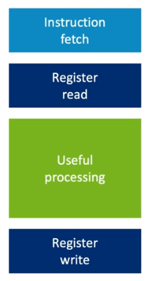

#! https://zhuanlan.zhihu.com/p/573930989
# 深入探索移动端GPU图形架构

## 一. The Rendering Pipeline
### 渲染管线中的各个阶段各自负责那些工作呢？
管线中总共有四个工作阶段参与：

#### 1. CPU Application： 
CPU会执行应用程序以及图形驱动程序。这工作阶段主要负责前置作业， 比如动画或是物理运算，并将CPU所产生的数据写入DRAM之中，并且发送绘图指令到GPU。
#### 2. command processing：
指令处理阶段则是在GPU内的控制阶段，负责解译从CPU传来的绘图指令，协调 GPU 的数据处理阶段。
#### 3. geometry processing：
##### 3.1 未优化之前的Geometry Processing
几何处理阶段则是会读入网格模型， 然后送出多边形的串流，一般来说就是三角形（绿色使用者定义的shader来处理，蓝色显示固定功能的硬件来处理）。 

**Tessllation shader:** 镶嵌处理则是一种非必要的管线阶段,可以用来将模型座程序化的细分,可以动态的增加几何物件的细节,他本身实际上还包含三个子管线阶段,由两个可程序化的管线阶段 ,跟一个固定功能的tessellator所组成(镶嵌是非常耗效能的技术, 这技术很少出现在市面上的手游之中)
**Geometry shader:** 几何处理技术在现今已经有些过时,大部分几何处理适用的案例,都可以被现今的运算处理所取代
**Primitive Shader:** 可以使用顶点串流组合，也可以由index buffer组合成点、线或是三角形。
**Primitive Culling：** 开始处理在视野内可见的多边形，并且丢弃掉不在视野内的多边形，如此可以减少接下来像素处理的工作量。

##### 3.2 Better Geometry processing
背向摄影机一般称之为模型的反面，也可以藉由facing test来剔除，但是事实上却很没效率，因为剔除工作發生在管线最末端，在我们已经花费珍贵的电力处理完端点之后，即使我们已经在应用程序端做了完美的可视范围剔除，我们仍然可能需要丢弃一半的端点，只因为他们是背向摄影机。因此大部分的GPU事实上会重组管线顺序，让剔除工作儘量在早期执行，下方的图显示的是Mali GPU中的管线工作阶段顺序

在这个改进之中，vertex shader会被shader compiler分成两个部分
* 前半段部分负责计算端点位置，剔除工作仍然是在前半段shader执行之后才执行
* 而后半段部分则负责计算与端点位置无关的所有属性值，后半段shader则是在剔除工作之后执行。

#### 4. pixel processing： 
像素处理阶段则会取用几何处理阶段多边形的数据，光栅化这些数据以产生pixel coverage，然后执行像素运算来计算出每个像素的颜色。

##### 4.1 Rasterizer
像素处理的第一个阶段是光栅化，这个阶段会取得三角形的真实向量然后compares it against a per-pixel sample mask to determine which parts of the framebuffer get colored in.
* 一般情况下，每个像素应该只会产生单一的fragment shader计算，但是invocation rate有时会较高，比如使用多重取样时；计算率有有可能较低，比如使用可变速率着色(VRS，variable rate shading)
* 当光栅在产生输出时,是以2x2的像素区块为单位，称之为quad. quad形成像素渲染的基本单位.因为藉由空间相邻的四个像素, 硬件才能计算出mipmap以及非等向性过滤所需要的导数ddx。
* 太小的三角形可能只包含quad中部分的取样点,将会导致硬件中部分fragment shader通道的闲置,进而降低了shader的执行效率

##### 4.2 Early ZS test
在shader程序码中使用gl_FragDepth来修改深度值，将会导致Early ZS的功能被关闭，进而强制像素执行Late ZS测试，而在像素shader执行之后丢弃掉像素是代价很高的工作，因此应用程序应该尽量避免。
* Late ZS测试發生在像素shader执行之后，负责处理所有像素处理之前无法处理的，深度以及stencil的测试及更新
* 为了利用到Early ZS测试的加速，应用程序必须将几何数据依照由前往后的顺序送出，如果应用程序由后往前送出几何数据，则会完全无法利用到Early ZS测试的加速。

##### 4.3 Blend
混色阶段则是固定功能的阶段，混色阶段负责根据应用程序设定的混色方式，将透明像素的颜色与画面颜色混合

##### 4.4 Better Pixel Processing

原始的pixel processing管线阶段顺序，它包含了两个没有效率的地方：
* 第一，Early ZS测试非常依赖应用程序端依照正确的顺序送出几何数据，

  * **hidden surface removal：**
为了解决几何物件排序对Early ZS测试造成的影响，现代的硬件都使用了所谓隐藏面移除（hidden surface removal）的技术，这种技术可以剔除被遮蔽的像素，即便几何数据没有依照由前往后的次序送入。 但是由前往后渲染不透明物件仍然是最好的方式，但是这项技术可以补足渲染次序错误的部分，并且剔除掉大部分的被遮蔽像素，而Late ZS测试及更新被设计成可由shader程序码触發的功能，让Late ZS可以在程序码达到触發条件时，立刻被触發，这样可以最大幅度减少对被遮蔽的像素做不必要的运算。
* 另外一个关于管线的重要概念是parallelize处理：应用程序在CPU端建立起draw call，接着在GPU端做几何处理，再接着由GPU端做像素处理，这些阶段在管线中循序进行，因此，为了让管线中所有阶段不会閒置，我们需要让多个工作同时在硬件上执行。一旦硬件无法有效的parallelize处理工作，就会导致渲染效率降低.

  * 让GPU中每个管线阶段的工作可以尽可能的重叠,是图形最佳化的一个最重要的目标
  * OpenGL ES的API是一种同步的API架构，有些API（比如glFinish）会强制执行同步行为。
  * 现代图形API基本上都是非同步架构。 Vulkan则是为了现今的硬件而设计的API。所以Vulkan提供了一个非同步工作的架构。但这会需要应用程序藉由明确的安排数据写入与读取间的相依性，去定义哪些工作可以parallelize处理。

#### Other details
* Shader： 程序可以定义执行在每个端点跟像素上的运算
* Buffer： 缓冲则用来存放输入的端点数据、几何数据以及场景的资讯、几何数据以及场景的资讯，像是每个物件的转换矩阵，或是动态光源的资讯等等
* Texture： 贴图则包含影像数据，色彩或非色彩data，这些数据可以在渲染阶段作为输入使用，它们也可以被拿来当作画面缓冲使用，将渲染管线处理后的数据写入
* Descriptors： 控制资源数据组织，provide supplemental information to the GPU.  每一个资源都需要一个descriptor来记录其在内存中的位置和如何被存取（where it is in memory and how it should be accessed. ），每一个渲染指令都会引用到一个descriptor。来告诉GPU每个draw call配置，并且列出所有完成运算所需要用到的资源，当CPU送出指令到GPU，指令处理器就会读取对应的descriptor，并用这些资讯来设置好接下来的渲染管线。

### 5. Compute Processing Stage

**Compute Processing**：
运算处理并不是渲染管线必要的阶段,上面其他的工作阶段组成严格的管线（数据由一个阶段传至下一个工作阶段，直到最后输出应用程序所需要的数据）。运算处理则是在这些管线之外，直接由main memory抓取数据，然后在运算完成之后将结果写回main memory，并转换成缓冲或是贴图的格式，这使得运算处裡可以在管线的任一阶段介入。
* eg： 举例来说，可以用来动态产生程序化的网格模型 ，然后存放在缓冲中，最后在几何处理阶段中读入。

## 二. GPU Architecture
当我们在谈论GPU架构时，通常我们谈论的是GPU的宏观设计，以及渲染管线如何与应用程序以及驱动程序沟通，高阶渲染API提供了很厚的抽象层。
在现今的市场上，有着许多相当不同的GPU架构设计，在任一个GPU核心元件的设计中都包含两个主要处理阶段以及一个输出画面缓冲用来存放处理后的像素结果。

这三个部分由某种数据传输方式串连起来。 传输方式的不同，成了不同GPU架构的设计依据。

### 1. Immediate Mode Pipeline 

接下来的动画会展示传统的立即模式渲染是如何运作, 首先多边形会依照应用程序送出的顺序依序处理, 这代表了渲染有时会在屏幕上的同一个位置,重复处理之前已经处理过的像素。
* 中间蓝色和绿色重叠的部分会重复绘制两次）。

立即模式渲染将几何处理，以及像素处理，使用GPU中的简单的先入先出缓冲相连，或称为FIFO缓冲，几何处理会将三角形推入FIFO缓冲中。
* 缓冲用尽时暂停，然后等待像素处理单元处理。像素处理会将多边形由此缓冲中取出，并依据多边形串流的次序来依序处理。

* 像素处理的工作范围涵盖整个画面，因为任何一个从FIFO缓冲中读入的三角形可能落在屏幕的任何地方，这个范围太大，所以于无法全部存放在chip之中，而是存放在主main DRAM 之中。
* 这样的架构会将三角形data存放于chip之中，所以几何处理的成本较低，但像素处理的成本较高。
* 粒度较细对API有较高的容错能力。

### 2. Tiled based Pipeline
下面动画展示的则是传统的Tile-based渲染行为，比如arm的Mali GPUs，首先，屏幕会被切割成许多较小的区块，称之为Tile，每一个Tile则会在所有fragment的渲染完成后才将结果写入main Memory，Draw call有时会在Tile之间交错进行，而Tile-based渲染会需要在fragment shader被执行前，确认每个Tile中有那些多边形需要被绘出。
* 每个render pass的几何处理的工作必须先完成，然后将处理后的resource以及intermediate state，比如Tile coverage infomation写入main Memory之中， 因为数据太大，无法暂时放置在GPU之中。

* 像素处理会将所有Tile依序处理，根据之前几何处理写入的Tile list来决定哪些多边形需要读入，因为Tile够小，所以可以将整个Tile所对应的画面缓冲data保存在GPU之中，处理完成的Tile则会将画面缓冲的data写回Memory。 

* 几何处理是第一个部分而且必须在第二部分像素处理开始前全部完成。 这样的设计由将成本较低的像素data保留在chip之中.来换取成本较高的几何处理。

#### immediate VS tile-based
Render passes会在最后一个drwa call后被产生， 所有的几何处理必须先完成，才能建立出Tile列表。 和immediate mode不同的是，Tile-based是以render passes来做区分粒度，而非draw call。

* 使用现代图形API（如：wulkan）dependency management需要更加小心的处理。 过度的依赖性，会导致不必要的顺序依赖。

### Tiled Based Rationale
因此目前大部分应用都是是像素处理要求比较高的，而Tile-based渲染的优势主要来自有效的使用in-GPU Tile Memory来写入画面缓冲的内容。许多常见的像素处理，像是深度测试、混色或是多重取样，都可以在GPU内部高速完成，而不用碰触到外部的Memory。

**TBR pros**

* 暂时性的输出，比如只有在render pass中需要的data，可以在Tile完成时直接被丢弃，可以节省DRAM bandwidth。
* 由于可以同时处理一个Tile中所有多边形的特性，使得硬件可以非常有效的执行隐藏面的消除工作，因为GPU可以看到所有多边形的前后顺序
* 可以更进一步的利用Tile Memory来当作，渲染管线的的暂存Memory。以利用这点来实现像是deferred lighting的算法，使得原本需要将暂存data写入外部Memory以便稍后的光照阶段作为贴图读入的deferred lighting变成可以全部在GPU RAM内部完成，而不需要在外部Memory来回搬运。

**TBR cons**
Tile-based渲染的一个缺点是: 必须使用外部Memory来存放几何处理完成之后的data,这使得几何处理的成本会比,立即模式渲染的几何处理成本要高,因为硬件需要额外的Memory频宽跟空间,来暂时存放几何处理后的data 。因此应用程序同时必须遵守一些API的调用规则,才能确保Tile-based渲染可以有效的parallelize处理
* 对于tessellation以及geometry shader,都会程序化的增加几何复杂度,因此会比较适合立即模式渲染的架构,因为增加的几何data,可以简单地写入FIFO之中,但对Tile-based GPU这些增加的几何data会需要写入外部Memory

## 四. Shader core hardware
再介绍可程序化GPU shader核心的设计原理之前，需要先了解 CPU 是如何高效的工作。

### CPU 
一般pc端的应用软件倾向使用相对来说更加顺序化的算法，有许多相依赖的控制逻辑，后面的行为取决于前面的的执行结果。 这样限制了应用程序并行运算的机会。
### CPU解决方案
* low thread count 低线程数
* Performance gained by single thread acceleration 通过单线程加速获得的性能
* Sensitive to memory latency 对内存延迟敏感
  * 读取内存，一般都会有几百个CPU週期的延迟

#### Processor essentials
运算会被切分成好几个阶段,一般管线大约花费5-10个周期执行,若是每个阶段的运算量可以减少就可以使用更高的CPU时脉,

有几种技巧可以用来提高指令速度：
* result forwarding: 前面指令的结果在写入暂存器之前,可以转发给后面指令使用. 可以节省掉几个写入延迟的週期
* 分支预测 ：对于流程控制，我们可以加入硬件来，试着预测可能的条件分支，然后我们会先执行预测的路径，如果预测错误则硬件可以回朔，取消掉错误的路径指令，然后重置。如果预测正确，则我们可以保持管线没有閒置.
* 增加新的硬件： 增加新的硬件来管理平行的指令派发。 
* 乱序执行：现代的CPU已经无法单纯使用循序的平行指令派发，来让足够多的指令同步执行。因此高阶的CPU通常会包含某种形式的乱序执行，这让CPU可以找到足够多的指令来进行同步派发并在发现符合条件时立即派发  
* Sepculative Execution： 很多CPU会使用推测执行， 类如：同时执行if以及else的分支。
* 预抓取 prefetch： 从memory中抓取资料非常耗时， 因此CPU通常会包含某种形式的预抓取单元，并预先将资料抓取到CPU的data cache中。因此CPU通常会包含较大的L2，L3 cache。

上面各种方法在提高cpu指令运算速度的同时 但是，也会大幅增加晶片的面积增加相对应的功耗
### GPU
GPU如何在提高计算效率的同时避免增加晶片的面积和功耗。 因为有效率的使用电源正是GPU最需要的。

**GPU解决方案**
* 非常多的线程数 Very high thread count
* 通过计算吞吐量获得的性能 Performance gained by computational throughput
* 高能效硬件实现的吞吐量 Throughput achieved by energy efficient hardware

#### Shader core essential
 
* shader核心可以跑多个Thread。放弃单一能效，追求计算的吞吐量。
* 不再需要运算结果转发或是分支预测，因为放弃了追求单一指令的效率。
* GPU使用巨量thread来弥补延迟： CPU利用聪明的预抓取以及data cache来弥补，对于图形处理来说，data cache资料快取永远都不够大（因为一个画面的渲染资料，很容易就超过50MB，这样的大小完全无法塞进晶片上的快取memory ）

#### SIMD VS SPMD
SIMD（Single Instruction Multiple Date） VS SPMD（Single Program Mulptiple Data）

SIMD对支持vector4（XYZW或RGBA） 运算友好，但是不适合现今复杂的Shader代码，因此有了SPMD。 
* SPMD： 保留向量硬件但转换至SPMT模式，也就是单一程序多thread模式
* thread群组有很多别名: Warp, Wavefront, wulkanSubgroup

**warp divergence：**
一个缺点就是程序分支会造成问题：因此硬件必须执行if以及else的程序码，然后每个通道再选择出正确的分支结果，在这种情况下，我们就只能得到50%的硬件运算力，这就称作warp divergence。
* 因此shader算法应该尽量避免这种状况

#### fixed Programmable core
常见单元包含属性
* interpolators,贴图解压缩,贴图取样跟过滤,以及alpha透明混色等等的元件,这些单元比起使用通用指令来处理,可以更有效率.

* 在图中的浅蓝色方块代表programmable核心,而在可程序化核心外围的方块,代表一些额外的固定功能单元,用来产生以及结束thread以及fragment front-end
  * fragment front-end： 光栅化,early ZS测试，以及隐藏面消除等等的工作,
* Tile writeback则会负责处理所有,将完成的Tile写入memory的工作,包含multisample的结果以及画面缓冲的压缩,当把所有这些单元合起来，可以得到所谓的shader核心。

## 五. 最佳实践原则
引入：Antoine de Saint-Exupéry： A designer knows he has achieved perfection not when there is nothing left to add, but when there is nothing left to take away
#### 在游戏开发中，提高GPU性能的使用原则：

花费周期以获得视觉效果 visual benefit
* 剪掉不影响重量的东西

不需要物理精度（Physical accuracy not required）
- 没有正确答案
- 快速近似是可以的

不需要相同的输出（Identical output not required）
- 没有正确答案
- 快速近似是可以的

没有渲染很难判断影响
- 实证测试替代方案（Empirically test alternatives）

#### Target FPS,  Resolution, Format
标设备的真实评估以及想要的渲染管道, 然后计算出分辨率和帧率，color format选项。
带宽（bandwidth）像素（pixels）* colorformat 

**shader Buggets：**

**Asset Budgets:**

* Draw Call: about 500 draw call  per frame
* Primitive Count: Use LODs to simplify meshes
* Material Count/resolution

## Frame construction
介绍如何更有效地构建frame框架，充分利用设备的资源。
### Frame Graph
Render passes drive tile-based renderers:
基于 tile 的硬件中获得最佳性能，需要确保数据流充分利用片上磁贴存储器，最大限度地减少使用外部 DRAM 访问，并确保顶点和片段处理, 可以很好地并行化，没有任何调度气泡。
### RenderPass
每个渲染过程都被声明为一个显式的 loadOp，storeOp和resolveOp。

#### 减少RenderPass拆分
RenderPass是基于图块渲染的主要构建块。在片段着色期间，对于每个图块，图块缓冲区都被初始化到RenderPass的起始状态，局部着色，然后写回内存，反映渲染过程结束时的状态。

* 最大限度地减少 GPU 和外部 DRAM 之间的流量。
* 在渲染过程中，local tile-buffer 中保留的内容不需要存入主存,除非需要在多个render pass之间保持不变。
  * 例如，多采样帧缓冲区可以作为 tile 回写的一部分来解析，所以只有解析的数据会产生任何带宽开销。原始多样本数据被简单地丢弃。
* API 没有明确的RenderPass概念，API不同就存在不同实现方式。
  * OpenGL ES 中的RenderPass完全是动态构建的: glBindFramebuffer()更改绘制目标，eglSwapBuffers()来结束一帧，会将当前排队的命令转换为RenderPass，并开始一个新的RenderPass。
  * 更改当前绘制目标的附件绑定，调用 glFlush()、glFinish() 或 eglMakeCurrent()都可以导致当前排队的命令转换为RenderPass。
  * 渲染过程中的第一个命令，应该是 Clear、ClearBuffer 或 Invalidate()，在 glBindFramebuffer() 之后在任何draw call之前。

> Note： 
> * incremental render：在创建新的RenderPass的情况下，继续绘制到表面，将导致我们所说的增量渲染。

#### API behaviour
**loadOp:** 没有明确的 loadOp，但是渲染过程中的第一个命令，在 glBindFramebuffer() 之后,在任何draw call之前，应该是 Clear、ClearBuffer 或 Invalidate.(vkCmdClear 消耗大，而且更慢)。

**StoreOp：** 如果RenderPass中附件的最后一个操作，在最后一次draw call之后，在将绑定更改为新的帧缓冲区之前，是无效的，那么数据将被丢弃，并且根本没有写回内存。

* 避免使用 glBlitFramebuffer() 进行多重采样解析，会让多重采样数据必须通过 DRAM 往返。

#### 诊断RenderPass效率
绘制框架图可以分析诊断RenderPass效率：显示RenderPass和它们之间的数据流。在这个图中，大的灰色框是RenderPass，白色的小盒子是附件，线条显示数据流。实线表示用作附件，而虚线表示作为纹理的消耗。
简单的框架图示例：

##### 优化步骤：

1. 单独输入：此步骤中突出显示的附件没有输入，因此，应该清除或无效，作为传递中的第一个操作。这避免了来自 DRAM 的不必要的回读
2. 单独输出：此步骤中突出显示的附件没有下游消费者，所以应该作为pass中的最后一个操作无效。这避免了在每次传递结束时对 DRAM 进行不必要的写入。
3. 直接连通： 读取一次传递的输出附件的情况，作为稍后传递的输入附件，没有任何干预用作纹理。这些可以合并到一个RenderPass中，避免中间分裂。

##### FrameBuffer Compression
这里以Arm架构的GPU为例。
AFBC is automatically applied
- 无损压缩
- 通常将带宽减少 $30 \%$ - $50 \%$

颜色格式限制
- Only 32-bpp formats (e.g. no RGB.f16, or RGBA.f16)
- Only UNORM formats until Valhall (e.g. no float, int, sint)
- No MSAA formats

运行时限制
- The imageload/Store() path does not support AFBC
- Will need to insert decompression pass on first image() use
- Will flag subsequent uses to not compress at all

基于创建图像视图时使用的图像标志。AFBC，图像必须使用 IMAGE_TILING_OPTIMAL 内存布局，并且不得使用 IMAGE_USAGE_STORAGE，IMAGE_USAGE_TRANSIENT，或 IMAGE_CREATE_ALIAS。
* 颜色数据的 Tile memory 需要能够存储同时所有颜色附件，在考虑附件数量时，样本数，以及它们的颜色格式。在现代 Mali 上使用超过 256 位/像素将导致tile size dropping。

##### Compute Shader
**Appropriate compute dispatches:**
在有算法优势的地方使用计算
- 共享计算(signle program)
- 共享数据获取

Naive replacement of fragment shaders is usually slower
- 用着色器代码替换有效的固定功能路径

一些常见的陷阱
- 使用 imageload() 比访问 texture() 慢
- 使用 imageStore() 比帧缓冲写入慢
- 使用 imageLoad/Store() 会丢失帧缓冲压缩

##### Avoiding pipeline bubbles
**GPU管线调度：**
基于图块的渲染运行a deep pipeline， 来自不同渲染通道的重叠顶点和片段处理(overlapping vertex and fragment processing from different render passes)保持 GPU 硬件忙碌。
* 对于 OpenGL ES，大部分依赖driver管理

* 在 Vulkan 中，管理 GPU 命令之间的执行依赖关系是应用程序的责任。

**Double buffering**
应用程序设置交换链深度
- 双缓冲 = 更低的延迟
- 三重缓冲 $=$ 更高的吞吐量

小心双重缓冲
- 帧率锁定为 60 倍

开发出现卡顿
- No visible FPS improvement
- Project lead despair!

**Beware display rotation:**
应用程序视图通常旋转,匹配设备的逻辑方向，而不是面板的物理方向。这对于显示控制器的效率至关重要。

* opengl由驱动控制，vulkan由应用程序控制
* 每一帧，使用交换链中的 preTransform 提示，确保交换链输出图像与面板方向匹配。

设备可以逻辑旋转
- 应用程序看到横向或纵向渲染目标

Display panels do not physically rotate
- Scan line orientation doesn't change
- Wrong orientation reads can be expensive

### 最佳资源（Content）实践
核心点就是降低geometry的数量。
* 由于移动端TBR架构，导致geometry数量多，效率就会非常低。

**Blended overdraw**
过度绘制放大像素数
- 多层阴影

不透明透支大多已解决
- 早期的 ZS 和 HSR

透明透支仍然是个问题
- 混合
- 覆盖或着色器丢弃的 Alpha
- 从平铺缓冲区读取的着色器

常见原因：
- 2D 内容和用户界面
- 树叶
- 粒子系统

解决方案：

### 最佳Shader实践
减少浮点运算

尽量使用内建shader函数（use built-in function）, Use built-in functions Carefully ...
Some built-in functions are expensive
- Most are more expensive with highp inputs
- Prefer mediump where possible

**Try to avoid:**
- Trigonometry
$-\sin (), \cos (), \tan ()$
$-\ldots$ and friends
- Atomics
- textureGrad()

**相同的运算尽量移植到CPU端**
Shaders often include uniform computation，Avoid uniform computation，Move uniform computation to the CPU，
- Expressions where only inputs are uniforms and literals
- Result is identical for every thread in a draw call
* Drivers can optimize this
  - ... but it's not free

**Specialization helps**
编译时专业化生成最高效的着色器Compile-time specialization generates the most efficient shaders
- 运行时决策总是有开销

Basic specialization
- Compile-time control flow selection for if and loop limits (vs. uniform-based branches)
- 编译时文字（与基于统一的“常量”相比）
- 完全链接的管道（与单独的着色器对象相比）

Usage oriented specialization, e.g.
- Position-only shader variants for shadow mapping
- Non-instanced shaders when instance count $==1$

**平衡Shader Specialization和创建和管理大量着色器变体**

**Beware branches**
Beware branches， but don't go crazy avoiding them。 Graphics compilers are very good at avoiding simple branches
- Conversion to arithmetic
- Conversion to conditional select
 
Clever tricks to "fix" branches often slower
- Compiler usually can't unpick

**Pack vertex inputs**
加载/存储指令将加载/存储向量
- 更长的向量 $=$ 更少的指令
- 例如。 vec4 比 $2 x$ vec2 更有效
插值器指令将插值向量
- 打包变量 $=$ 更少的指令
- 例如。 vec4 比 vec $3+$ float 更高效

**Beware late-ZS triggers**
Use of discard statements
- Forces late-ZS update, disables HSR

Use of shader writes to gl_FragDepth
- Forces late-ZS test and update, disables HSR

Use of shader ZS reads from framebuffer
- Forces late-ZS update, disables HSR

Use of shader color reads from framebuffer
- Disables HSR

## todo 了解GPU的调度
### 参考资料

1. [Triple Buffering: What It Is & How It Works] (https://cybersided.com/triple-buffering/#Double_Buffering)
2. [Arm Mali GPU Training Series] (https://youtu.be/tnR4mExVClY)
3. [vulkan-tutorial] (https://vulkan-tutorial.com/)
4. [VulkanGuide] (https://vkguide.dev/)

