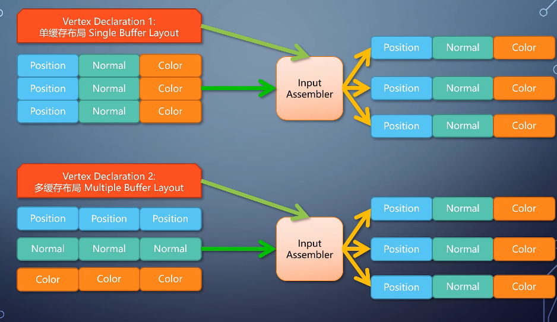

# GPU 综述
### 图形流水线
1. 帧缓存（framebuffer）:
    * 在内存， 这块内存的区域和显示器的每个像素是一一对应的。现代计算机适合4字节对齐（32bit，对应一个像素）
    * 早期显卡： 把帧缓存的内容输出到显示器
    * 增加各种PU单元，执行shader， eg：输入装配单元
     
    * 早期GPU流水线：
    

### GPU逻辑模块划分
1. 逻辑单元
    * GPU:
    

### 硬件单元
1. GPU具有复杂的逻辑单元，如何将其安排到硬件上？
    * 考虑负载均衡问题： 逻辑单元不可简单安装一定配置比映射到硬件上
2. Unified Shader Architecture
    * 不需要区分vertexshader单元和pixelshader硬件单元： shader可以有很多种类但是硬件的执行单元可以是统一的。
    * FP32 ALU（高精度浮点运算 + Sampler（采样器）：
    
    * 调度器(Scheduler)： 控制执行顺序, 分配ALU，Sampler
3. GPU核数
    * GPU核心数量和CPU概念不一样：CPU指令SIMD(SSE , AVX-512)
    * Warp（wave）：一组线程SIMD，SP（流处理器）与Warp对应。
    * SM:  
4. 并行流水，分支分歧：
    * SIMD：两个分支都执行，采用select操作选取结果：
    
    * MIMD :Nvida实现，增加停等instruc， 还是和selct一样每个分支执行，但是功耗将下来了（因为一半计算停下来了）
5. 显存
    * 现存类型GDDR： 一次读写很宽的数据。
    * 计算掩盖访存：
      

### 图形流水线的不可编程单元
1. 广义光栅化器：PrimitiveAssembler + Rasterizer
    * 扫描线算法： ddx， ddy（每个三角形只需要算一次）
      
    * 光栅化规则：
        * 普通模式： 光栅化后的像素中心是否在三角形内部， 对于线： 线是否经过像素里的棱形区域。
        * 保守式光栅化： 沾到就是覆盖（常用于体素化）
2. 将光栅算法部署到硬件上
    * 实际光栅化输出是一个2x2像素的一个quad
    * 立即式光栅化： PC端，逐像素,频繁读写，能耗高
    * tiled based： 移动端。
        * 每个tile 包含一个列表，保存所有和tile相交的三角形一起处理。
        * 需要有片上内存充当cache： 把render target对应的区域载入cache建立映射，CliipMemory比GPU内存要快的多，且省电
        
3. 性能分析
    * tile based  由于三角形会被tile打断，性能会下降。同时在多个RT切换时候，对于tilebase方式来说开销很大。
    
    

4. early-Z: 
    * 不能独立存在，需要满足：不输出深度， 没有discard
5. TBDR模式（tile-based Deferred Rendering）： 
    * TBDR在开启深度测试的情况下（需要一系列条件满足才能开启）：
        * 将光栅化的像素属性都写入片上内存: pixel{ position：<x,x,x>; Color:<x,x,x> },  根据信息不可见像素被丢弃
6. Tiled caching（Nvdia Mawwell开始）
    * tile 比较大，cached也比较大
    
4. output merger

###  光线跟踪流水线