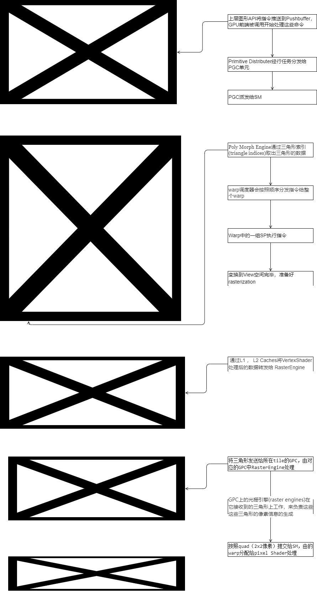
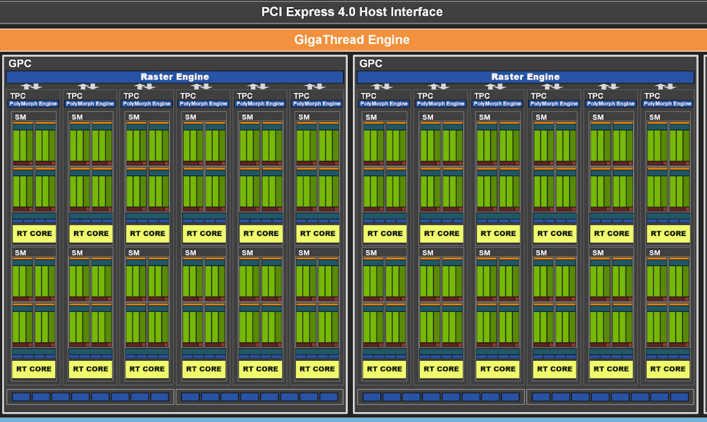

# 深入探索GPU
### 图形流水线
1. 帧缓存（framebuffer）:
    * 在内存， 这块内存的区域和显示器的每个像素是一一对应的。现代计算机适合4字节对齐（32bit，对应一个像素）
    * 早期显卡： 把帧缓存的内容输出到显示器
    * 增加各种PU单元，执行shader， eg：输入装配单元
         
2. GPU所有功能单元：
    * 
3. 图形流水单元
    * 图形流水线：
    
4. Pipeline Architecture Image
    * fermipipeline
    
    * Ampere GPU Architecture
    

### GPU逻辑模块划分 
1. GPU Logical Architecture 
    * Architecture In-Depth：
    
    
2. Giga Thread Engine： 管理引擎
    * 管理GPU工作，负责最上层的任务调度
3. GPC(graphics process cluster)： 每个GPC拥有多个SM和RasterizerEngine, GPC通过Crossbar连接
    * SM： 多个流处理器SP， 一般至少2组Warp， 拥有Poly Morph Engine。
    * Wrap： 管理一组core（SP），由Warp Scheduler管理调度，基本线程单元。
    * SP/Core： 流处理器Stream Processor 和core一个概念， 基本执行指令单元。
    
3. 图元分配器(Primitive Distributor)：
    * 通过indexbuffer分配（batchs），分配三角形给GPC。
4. Poly Morph Engine： 
    * 在SM中，负责通过三角形索引(triangle indices)取出三角形的数据(vertex data)
    * 顶点数据提交给warp进行锁步（Lock-step）执行，条件分支会消耗性能或者会降低流水。
5. warp：
    * warp执行各种到变换到view空间的vertex完毕 ，将三角形发送给所在tile的GPC，由对应的GPC中RasterEngine处理（注意：一个三角形可能对应多个GPC）
6. 光栅引擎(raster engines)
    * 每个rasterEngine管理多个tile，同时会处理裁剪，背面剔除，（early-Z，需要满足条件）
    * 处理后的tile，按照quad（2x2像素）提交给SM，由的warp分配给pixel Shader处理。
7. output merger/ROP(render output unit，渲染输入单元)
    * 像素着色器完成了颜色的计算还有深度值的计算，最后的深度测试，alpha测试，framebuffer混合

### 硬件单元
1. GPU具有复杂的逻辑单元，如何将其安排到硬件上？
    * 考虑负载均衡问题： 逻辑单元不可简单安装一定配置比映射到硬件上
2. Unified Shader Architecture
    * 不需要区分vertexshader单元和pixelshader硬件单元： shader可以有很多种类但是硬件的执行单元可以是统一的。
    * FP32 ALU（高精度浮点运算 + Sampler（采样器）：
    
    * 调度器(Scheduler)： 控制执行顺序, 分配ALU，Sampler
3. GPU核数
    * GPU核心数量和CPU概念不一样：CPU指令SIMD(SSE , AVX-512)
    * Warp（wave）：一组线程SIMT，SP（流处理器）与Warp对应。
    * SM:  
4. 并行流水，分支分歧：
    * SIMT：两个分支都执行，采用select操作选取结果：
    
    * MIMD :Nvida实现，增加停等instruc， 还是和selct一样每个分支执行，但是功耗将下来了（因为一半计算停下来了）
5. 显存访问
    * 现存类型GDDR： 一次读写很宽的数据。
    * 计算掩盖访存：当当前warp等待内存加载时候，warp schedule会切换到另外一个没有内存等待的warp。 

### GPU的内存架构/显存
1. GPU内存是多级结构,它们的存取速度从寄存器到系统内存依次变慢：
    
    |存储类型	|寄存器|	共享内存|	L1缓存	|L2缓存|	纹理、常量缓存|	全局内存|
    | :---: | :----: | ----: | :----: | :----: | :----: | :----: |
    |访问周期|	1	| 1~32	| 1~32	| 32~64	|400~600|	400~600| 
    

### 图形流水线的不可编程单元
1. 广义光栅化器：PrimitiveAssembler + Rasterizer
    * 扫描线算法： ddx， ddy（每个三角形只需要算一次）
      
    * 光栅化规则：
        * 普通模式： 光栅化后的像素中心是否在三角形内部， 对于线： 线是否经过像素里的棱形区域。
        * 保守式光栅化： 沾到就是覆盖（常用于体素化）
2. 将光栅算法部署到硬件上
    * 实际光栅化输出是一个2x2像素的一个quad
    * 立即式光栅化： PC端，逐像素,频繁读写，能耗高
    * tiled based： 移动端。
        * 每个tile 包含一个列表，保存所有和tile相交的三角形一起处理。
        * 需要有片上内存充当cache： 把render target对应的区域载入cache建立映射，CliipMemory比GPU内存要快的多，且省电
        * 在像素着色器中，会将相邻的四个像素作为不可分隔的一组，送入同一个SM内4个不同的Core
            - 优点： 加速像素分派工作，降低schedule任务。
            - 缺点： 对于小的三角形（占比小于四个像素），会造成over draw。
        
3. 性能分析
    * tile based  由于三角形会被tile打断，性能会下降。同时在多个RT切换时候，对于tilebase方式来说开销很大。
    
    
4. early-Z: 
    * 不能独立存在，需要满足：
        - early-Z ： 需要显示开启
        - Alphatest不开启，
        - 不能有tex kill：即在shader代码中有像素摒弃指令（DX的discard，OpenGL的clip）
        - 不能开启Multi-Sampling：多采样会影响周边像素，而Early-Z阶段无法得知周边像素是否被裁剪，故无法提前剔除
        - 不需要混合:没有透明，半透明存在。
5. TBDR模式（tile-based Deferred Rendering）： 
    * TBDR在开启深度测试的情况下（需要一系列条件满足才能开启）：
        * 将光栅化的像素属性都写入片上内存: pixel{ position：<x,x,x>; Color:<x,x,x> },  根据信息不可见像素被丢弃
6. Tiled caching（Nvdia Mawwell开始）
    * tile 比较大，cached也比较大
    
4. output merger

###  光线跟踪流水线

##### 参考文献: 
* [1] [life-triangle-nvidias-logical-pipeline](https://developer.nvidia.com/content/life-triangle-nvidias-logical-pipeline)
* [2] [A trip through the Graphics Pipeline](https://fgiesen.wordpress.com/2011/07/09/a-trip-through-the-graphics-pipeline-2011-index/)