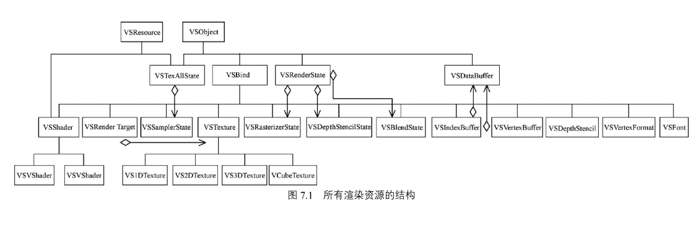
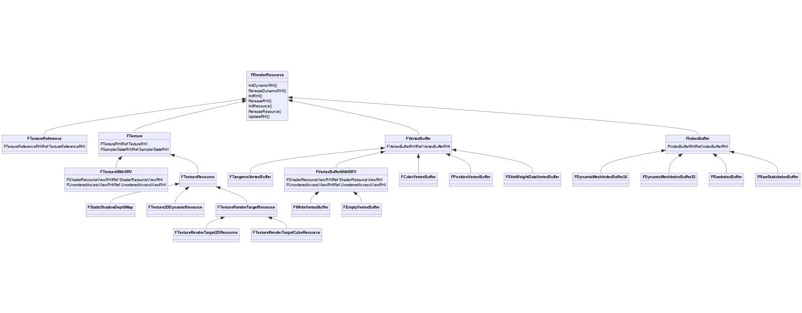

# RHI层设计总结

## 前言

RHI是Render Hardware Interface的缩写，现代图形引擎都会RHI把各个平台的图形API抽象成统一的接口，供上层渲染来使用。 这样引擎的上层代码就可以避免直接和底层细节直接调用。
优点很明显：
* 可以实现跨平台
* 上层渲染线程只需要和RHI提供的API接口打交道。 
* 隐藏底层细节， 如： 
  * texture缓存池， 着色器缓存池， renderTarget（也叫color attachment）缓存池。
  * API 调用的细节参数


## RHI层结构设计

一般而言对各类平台图形API会抽象出各自的RHI层。 如：
OpenglRHI，　DirectXRHI， VulkanRHI等。。。

### 1. RenderResource：渲染准备

#### RHI渲染资源
渲染一部分需要指令数据，另外一部分就是资源数据的准备。 通过对图形API资源的封装形成RHIResource（现代引擎一般还会对RHI资源进行进一步的封装以提供给渲染线程使用的RenderResource）。 下面就是对图形API资源封装（参考《游戏引擎原理与实践卷2》）。

eg:
```c++
class RHI_API FRHITexture2D : public FRHITexture
{
public:
	
	/** Initialization constructor. */
	FRHITexture2D(uint32 InSizeX,uint32 InSizeY,uint32 InNumMips,uint32 InNumSamples,EPixelFormat InFormat,ETextureCreateFlags InFlags, const FClearValueBinding& InClearValue)
	: FRHITexture(InNumMips, InNumSamples, InFormat, InFlags, NULL, InClearValue)
	, SizeX(InSizeX)
	, SizeY(InSizeY)
	{}
	
	// Dynamic cast methods.
	virtual FRHITexture2D* GetTexture2D() { return this; }

	/** @return The width of the texture. */
	uint32 GetSizeX() const { return SizeX; }
	
	/** @return The height of the texture. */
	uint32 GetSizeY() const { return SizeY; }

	inline FIntPoint GetSizeXY() const
	{
		return FIntPoint(SizeX, SizeY);
	}

	virtual FIntVector GetSizeXYZ() const override
	{
		return FIntVector(SizeX, SizeY, 1);
	}

private:

	uint32 SizeX;
	uint32 SizeY;
};
```

>Note:
>* RHI资源有平台相关的部分会被平台继承实现：如FRHIUniformbuffer涉及到DX12，Vulkan， OpenGL，Metal版本。
>* 也有与平台无关的部分: 着色器绑定，着色器，管线状态。

ue4对RHIresource进一步封装RenderResource

eg:
```c++
class FTexture : public FRenderResource
{
public:

	/** The texture's RHI resource. */
	FTextureRHIRef		TextureRHI;

	/** The sampler state to use for the texture. */
	FSamplerStateRHIRef SamplerStateRHI;

	/** Sampler state to be used in deferred passes when discontinuities in ddx / ddy would cause too blurry of a mip to be used. */
	FSamplerStateRHIRef DeferredPassSamplerStateRHI;

	/** The last time the texture has been bound */
	mutable double		LastRenderTime;
}
```
数据部分一般会存储在一个全局的RenderContext中。


#### 管线的状态的创建：
渲染管线的创建：
```c++
typedef struct VkGraphicsPipelineCreateInfo {
    VkStructureType                                  sType;
    const void*                                      pNext;
    VkPipelineCreateFlags                            flags;
    uint32_t                                         stageCount;
    const VkPipelineShaderStageCreateInfo*           pStages;
    const VkPipelineVertexInputStateCreateInfo*      pVertexInputState;
    const VkPipelineInputAssemblyStateCreateInfo*    pInputAssemblyState;
    const VkPipelineTessellationStateCreateInfo*     pTessellationState;
    const VkPipelineViewportStateCreateInfo*         pViewportState;
    const VkPipelineRasterizationStateCreateInfo*    pRasterizationState;
    const VkPipelineMultisampleStateCreateInfo*      pMultisampleState;
    const VkPipelineDepthStencilStateCreateInfo*     pDepthStencilState;
    const VkPipelineColorBlendStateCreateInfo*       pColorBlendState;
    const VkPipelineDynamicStateCreateInfo*          pDynamicState;
    VkPipelineLayout                                 layout;
    VkRenderPass                                     renderPass;
    uint32_t                                         subpass;
    VkPipeline                                       basePipelineHandle;
    int32_t                                          basePipelineIndex;
} VkGraphicsPipelineCreateInfo;
```
以上是Vulkan的渲染管线创建需要的CreateInfo，和OpenGL相比显得非常庞大，但是也避免了像Opengl内部维护了一个状态机。 可以将管线状态在上层接口出进行拆分单独函数，对各个CreateInfo单独输入：
RHICreateRasterizaerState
RHICreateGraphicsPipelineState
RHICreateBlendState

#### RHI资源的创建：
一维的buffer： vertexBuffer,UniformBuffer
二维的buffer：image


### 2. RenderCommandList： 渲染命令列表
整个渲染流程基本上就是通过camera得到view的可绘制物体的信息数据，将这些信息数据转换成commandlist和RHIresource。而其中的指令信息由渲染线程Push到RHI线程，然后RHI层DrawCall调用绘制命令执行。

commandBuffer可以允许多个线程并行提交，可以和上层设计的多线程框架结合起来。

这里以vulkan为例：

vulkan的commandbuffer记录各种vkcmdxxx的命令。 如下：
```c++
void HelloTriangleApplication::recordCommandBuffer(VkCommandBuffer commandBuffer, uint32_t imageIndex)
{
	//用来指定有关于这个命令缓冲的使用方法的一些细节——作为参数来开始记录命令缓冲
	VkCommandBufferBeginInfo beginInfo{};
	beginInfo.sType = VK_STRUCTURE_TYPE_COMMAND_BUFFER_BEGIN_INFO;
	if (vkBeginCommandBuffer(commandBuffer, &beginInfo) != VK_SUCCESS)
	{
		throw std::runtime_error("failed to begin recording command buffer!");
	}
	//绘制开始于使用vkCmdBeginRenderPass启动渲染过程
	VkRenderPassBeginInfo renderPassInfo{};
	renderPassInfo.sType = VK_STRUCTURE_TYPE_RENDER_PASS_BEGIN_INFO;
	renderPassInfo.renderPass = renderPass;
	renderPassInfo.framebuffer = swapChainFramebuffers[imageIndex];
	renderPassInfo.renderArea.offset = { 0, 0 };
	renderPassInfo.renderArea.extent = swapChainExtent;

	VkClearValue clearColor = { {{0.0f, 0.0f, 0.0f, 1.0f}} };
	renderPassInfo.clearValueCount = 1;
	renderPassInfo.pClearValues = &clearColor;

	std::array<VkClearValue, 2> clearValues{};
	clearValues[0].color = { {0.0f, 0.0f, 0.0f, 1.0f} };
	clearValues[1].depthStencil = { 1.0f, 0 };

	renderPassInfo.clearValueCount = static_cast<uint32_t>(clearValues.size());
	renderPassInfo.pClearValues = clearValues.data();

	vkCmdBeginRenderPass(commandBuffer, &renderPassInfo, VK_SUBPASS_CONTENTS_INLINE);
	//使用顶点缓冲进行渲染操作
	vkCmdBindPipeline(commandBuffer, VK_PIPELINE_BIND_POINT_GRAPHICS, graphicsPipeline);
	VkBuffer vertexBuffers[] = { vertexBuffer };
	VkDeviceSize offsets[] = { 0 };
	vkCmdBindVertexBuffers(commandBuffer, 0, 1, vertexBuffers, offsets);
	vkCmdBindIndexBuffer(commandBuffer, indexBuffer, 0, VK_INDEX_TYPE_UINT32);

	//描述符集并不是图形管线所独有的，所以需要我们指定我们要绑定的是图形管线还是计算管线
	vkCmdBindDescriptorSets(commandBuffer, VK_PIPELINE_BIND_POINT_GRAPHICS, pipelineLayout, 0, 1, &descriptorSets[currentFrame], 0, nullptr);

	vkCmdDrawIndexed(commandBuffer, static_cast<uint32_t>(indices.size()), 1, 0, 0, 0);

	vkCmdEndRenderPass(commandBuffer);

	if (vkEndCommandBuffer(commandBuffer) != VK_SUCCESS)
	{
		throw std::runtime_error("failed to record command buffer!");
	}
}
```
#### UE4的FRHICommand设计

### 3. DrawCall：渲染命令提交submit
DrawPrimitive()
DrawPrimitiveIndrect()
DrawIndexedPrimitive()
DrawIndexedPrimitiveIndirect()


### 4. Synchronization： 资源同步 
vulkan自身有一套多线程机制，这也是vulkan这种现代图形API性能提升的要点。　
具体的同步原语：Event、Semaphore、Fence


## 参考数据
1. [剖析虚幻渲染体系（10）- RHI] (https://www.cnblogs.com/timlly/p/15156626.html)
2. [【[UnrealFestOnline2020]用Unreal Insights收集、分析及可视化你的数据(官方字幕)】] ( https://www.bilibili.com/video/BV1Ay4y1q7Kj/?share_source=copy_web&vd_source=e84f3d79efba7dc72e6306f35613222e)