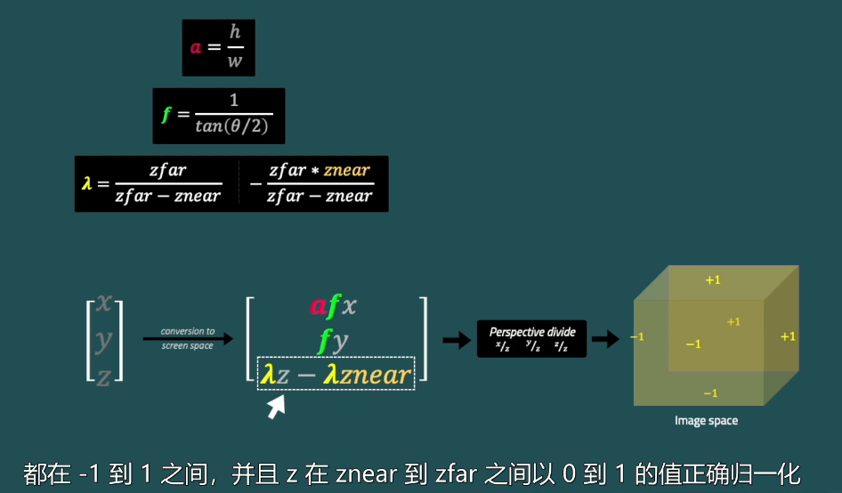
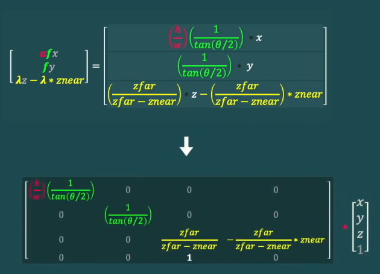

## 图形概念理解

### 矩阵便换
* 透视投影矩阵 ProjectMatrix：
    1. Aspect ratio（屏幕长宽比）： 根据屏幕调整长宽比
    2. Field of view： FOV
    3. 标准化/归一化(Normalization): 当进行透视投影后，下，x,y.z 都归一到[minValue, maxValue] (一般是-1，1)，归一化设备坐标，即NDC。
    4. Derivative： 
    
    