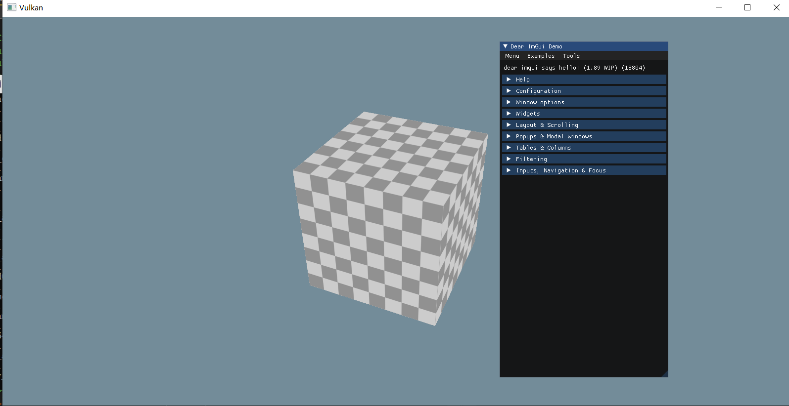

#! https://zhuanlan.zhihu.com/p/548747027
# 将 Dear ImGui 集成到自定义 Vulkan 渲染器中

**Prerequisite**

在学习vulkan tutorial过程中，给自己的项目代码加上了UI控件， 便于学习vulkan的渲染管线是怎样搭建的和实现一个离线算法（ps： 比OpenGL复杂很多）
此文主要是参考[Integrating Dear ImGui in a custom Vulkan renderer](https://frguthmann.github.io/posts/vulkan_imgui/)的文章基础上，加上了自己的实践总结。


### 接触Dear ImGui
Dear ImGui 包含在几个文件中，您可以轻松地复制并编译到您的应用程序/引擎中：
>- imgui.cpp
>- imgui.h
>- imgui_demo.cpp
>- imgui_draw.cpp
>- imgui_widgets.cpp
>- imgui_internal.h
>- imconfig.h（默认为空，用户可编辑）
>- imstb_rectpack.h
>- imstb_textedit.h
>-imstb_truetype.h
不需要特定的构建过程。您可以将 .cpp 文件添加到您的项目或#include从现有文件中添加它们。


这里需要注意什么？必须将所有 .cpp 文件添加到项目中。忘记其中一些似乎是一个常见的错误，因为我自己做了它，并立即找到了关于它的 Stack Overflow 帖子。我确信这是一个只有标题的库，结果不是。因此，如果您使用的是 Visual Studio，则应将上面列出的所有 .cpp 文件添加到源文件中。

好吧，让我们继续阅读。接下来是一个看起来很容易理解的代码示例。
```c++
ImGui::Text("Hello, world %d", 123);  
if (ImGui::Button("Save"))  
{  
    // do stuff  
}  
ImGui::InputText("string", buf, IM_ARRAYSIZE(buf));  
ImGui::SliderFloat("float", &f, 0.0f, 1.0f);
```
那怎么办？我是否只包含 imgui.h，复制并粘贴此代码示例，并且这一切都通过某种黑魔法起作用？那会很酷，但也不是很灵活。要了解为什么这不起作用，我们需要了解 Dear ImGui 是什么。首先，它是一个即时模式的 GUI，这意味着用户可以控制数据而不是 GUI 本身。这使得 GUI 比保留模式 GUI 低一点。然而，正如作者所说，将即时模式 GUI 与即时模式渲染分开是很重要的。
>即时模式渲染（…）通常意味着在调用 GUI 函数时，用一堆低效的绘制调用和状态更改来锤击你的驱动程序/GPU。这不是 Dear ImGui 所做的。Dear ImGui 输出顶点缓冲区和一小部分绘制调用批次 

这句话的有趣还有另一个原因。它只是为我们提供了使用 Dear ImGui 需要做什么的核心理念。我们需要能够使用它输出的顶点缓冲区并处理绘图调用批处理。它明确地解释了为什么我们不能简单地复制和粘贴一些代码示例。我们需要将 Dear ImGui 更深入地集成到我们的引擎中，以便能够处理其输出。我们如何做到这一点？好吧，自述文件的下一部分就是关于它的。
>在您的自定义引擎中集成 Dear ImGui 只需:
> 1) 连接鼠标/键盘/游戏手柄输入 
> 2) 将一个纹理上传到您的 GPU/渲染引擎 
> 3) 提供可以绑定纹理和渲染纹理三角形的渲染功能。examples/ 文件夹中填充了执行此操作的应用程序。

### 阅读样例

让我们打开示例文件夹，看看我们有什么。里面有很多东西，但只有两个关于 Vulkan 的文件夹：example_glfw_vulkan和example_sdl_vulkan. 我对 SDL 没有任何经验，我遵循的教程使用 GLFW，因此我们将在example_glfw_vulkan本文的其余部分使用。

在这个文件夹中有几个与构建相关的文件，Visual Studio 文件，着色器代码文件，最后是main.cpp. 在此文件的开头，您将找到一些有关如何设置 Dear ImGui 的相关信息。
>// dear imgui: standalone example application for Glfw + Vulkan
>// If you are new to dear imgui, see examples/README.txt and documentation at the top of imgui.cpp.

让我们从examples/README.txt. 它首先提醒您需要将字体加载到 GPU，将键盘和鼠标输入传递给 Dear ImGui，并为其提供渲染三角形的方法。到目前为止没有什么新鲜事。下一位包含更多相关信息。

>这个文件夹包含两个东西：
>* 流行平台/图形 API 的示例绑定，您可以按原样使用或适应您自己的使用。它们是在imgui_impl_XXXX文件夹中找到的examples/文件。
>* 使用上述绑定的示例应用程序（独立的、可构建的）。它们位于XXXX_example/子文件夹中。

所以基本上这意味着examples文件夹中有一些实际的示例应用程序，还有一些核心文件的扩展。这些扩展可用于更轻松地将 Dear ImGui 集成到您的引擎中。我们应该对imgui_impl_vulkan位于示例文件夹中的文件感兴趣。再读一点，看起来我们也需要这些imgui_impl_glfw文件。
>大多数示例绑定分为两部分：
>* “平台”绑定，负责：鼠标/键盘/游戏手柄输入、光标形状、时间、窗口。
示例：Windows ( imgui_impl_win32.cpp)、GLFW ( imgui_impl_glfw.cpp)、SDL2 ( imgui_impl_sdl.cpp)
>* “Renderer”绑定，负责：创建主字体纹理，渲染imgui绘制数据。
示例：DirectX11 ( imgui_impl_dx11.cpp)、GL3 ( imgui_impl_opengl3.cpp)、Vulkan ( imgui_impl_vulkan.cpp)

好的，所以现在你们中的一些人可能会认为他们想要自己编写所有代码，并且使用这些imgui_impl_vulkan文件是作弊或其他什么。是的，当然。您可以自己从头开始重写所有内容。如果您想控制整个代码库并使其一切都很好且统一，那么这可能是最终最好的方法，但作为第一步，采用简单的方法可能是最好的。
>* 如果您使用自己的引擎，您可能会决定使用一些现有的绑定和/或使用自己的 API 重写一些。作为建议，如果您是 Dear ImGui 的新手，请先尝试按原样使用现有绑定，然后再继续重写一些代码。尽管重写这两个imgui_impl_xxxx文件以适应您的编码风格是很诱人的，但考虑到这不是必需的！事实上，如果您是 Dear ImGui 的新手，重写它们几乎总是更难。

我认为就是这样examples/README.txt。到下一个文件，imgui.cpp. 那个有大量的信息。事实上，Dear ImGui 的整个文档都在那里。我不会一步一步地引导你，因为要介绍的内容太多了。如果您想重新编写imgui_impl_xxxx文件，这尤其有趣，但我们现在不这样做。

好的，回到我们来自的地方，main.cpp文件example_glfw_vulkan夹中的文件。现在我们已经简要阅读了文档，我们已经准备好了解接下来会发生什么。
> // Important note to the reader who wish to integrate imgui_impl_vulkan.cpp/.h in their own engine/app.
>// - Common ImGui_ImplVulkan_XXX functions and structures are used to interface with imgui_impl_vulkan.cpp/.h.
>//   You will use those if you want to use this rendering back-end in your engine/app.
>// - Helper ImGui_ImplVulkanH_XXX functions and structures are only used by this example (main.cpp) and by 
>//   the back-end itself (imgui_impl_vulkan.cpp), but should PROBABLY NOT be used by your own engine/app code.
>// Read comments in imgui_impl_vulkan.h.

这是一条非常重要的信息。我们被告知我们应该主要使用ImGui_ImplVulkan_XXX函数和结构，而不是ImGui_ImplVulkanH_XXX那些。为什么？因为这些是与 Vulkan 相关的辅助函数，并且您的引擎中应该已经拥有其中的大部分。

现在我们知道我们可以挽救什么以及必须将什么插入到我们自己的自定义引擎中，我们已经准备好阅读代码本身了。

### 研究案例代码

在main.cpp文件的开头，我们看到我们显然需要包含imgui.h,imgui_impl_glfw.h和imgui_impl_vulkan.h. 您还可以看到相关的包含，GLFW但您应该已经拥有这些。

之后，声明了一堆与 Vulkan 相关的变量和函数。这些是你应该已经拥有的。现在不要太担心它们，我们稍后会看到你的引擎需要公开什么来与 Dear ImGui 交互。为此，我们将直接查看该main函数。

**初始化Dear ImGui**

第一个代码块是关于设置 GLFW 窗口、Vulkan 上下文、表面和主帧缓冲区。为此，调用了我们之前跳过的一些函数。如果您已经有一个启动并运行的 Vulkan 应用程序，那么您已经在某个地方完成了此操作。稍后，我们将需要公开在此阶段创建的一些对象，例如 GLFW window，以便将 Dear ImGui 与您的引擎接口。

下一个区块最后是关于Dear ImGui 的一些细节。在这里，我们正在为 Dear ImGui 创建一个上下文，选择我们希望为其提供访问权限的输入和一个主题。这些只是来自的功能imgui.h，这里没有任何与 Vulkan 或 GLFW 相关的内容。
```c++
// Setup Dear ImGui context
IMGUI_CHECKVERSION();
ImGui::CreateContext();
ImGuiIO& io = ImGui::GetIO(); (void)io;
//io.ConfigFlags |= ImGuiConfigFlags_NavEnableKeyboard;     // Enable Keyboard Controls
//io.ConfigFlags |= ImGuiConfigFlags_NavEnableGamepad;      // Enable Gamepad Controls

// Setup Dear ImGui style
ImGui::StyleColorsDark();
//ImGui::StyleColorsClassic();
```
然后是棘手的部分，将引擎的相关部分暴露给 Dear ImGui。这主要是通过一个名为`ImGui_ImplVulkan_InitInfo`
```c++
// Setup Platform/Renderer bindings
ImGui_ImplGlfw_InitForVulkan(window, true);
ImGui_ImplVulkan_InitInfo init_info = {};
init_info.Instance = g_Instance;
init_info.PhysicalDevice = g_PhysicalDevice;
init_info.Device = g_Device;
init_info.QueueFamily = g_QueueFamily;
init_info.Queue = g_Queue;
init_info.PipelineCache = g_PipelineCache;
init_info.DescriptorPool = g_DescriptorPool;
init_info.Allocator = g_Allocator;
init_info.MinImageCount = g_MinImageCount;
init_info.ImageCount = wd->ImageCount;
init_info.CheckVkResultFn = check_vk_result;
ImGui_ImplVulkan_Init(&init_info, wd->RenderPass);
```

第一个函数ImGui_ImplGlfw_InitForVulkan来自imgui_impl_glfw.cpp. 它让 Dear ImGui 以非侵入性的方式与 GLFW 交互。例如，Dear ImGui 将有权访问键盘和鼠标事件，但之后仍会运行用户注册的回调。这样我们就不必关心处理与 GUI 相关的输入，我们仍然可以使用鼠标位置来控制相机。为了让库帮助您，您需要向它提供前面GLFW window提到的.

接下来是函数ImGui_ImplVulkan_InitInfo使用的结构ImGui_ImplVulkan_Init。如您所见，它们都遵循模式ImGui_ImplVulkan_XXX而不是ImGui_ImplVulkanH_XXX. 这意味着我们鼓励使用它们。我们已经可以看到，这个结构是您的引擎和 Dear ImGui 之间的一座桥梁。很多 Vulkan 内部结构都在这里暴露出来，我们将找出它们在我们的引擎中的位置。

**Vulkan 实例和设备**
第一个变量是g_Instance，这是VkInstance您必须通过vkCreateInstance调用创建的。它是 Vulkan 的低级砖块之一。它包含运行程序所需的扩展以及验证层。

然后来了g_PhysicalDevice和g_Device。这些应该是不言自明的，它们是VkPhysicalDevice您VkDevice在引擎中创建的。

**队列**

下一点可能有点令人困惑。该结构需要 aQueueFamily和 a Queue。如果您熟悉 Vulkan，就会知道大多数操作都是通过提交到队列的命令缓冲区完成的。队列来自允许有限操作子集的队列族。例如，一个族只能允许计算操作或传输操作。您自己可能正在使用多个队列，那么哪一个是正确的呢？最有可能的是图形队列，因为 Dear ImGui 只会绘制东西。如果您快速浏览代码，您会发现我们确实在寻找图形队列和相关系列。
```c++
for (uint32_t i = 0; i < count; i++){
    if (queues[i].queueFlags & VK_QUEUE_GRAPHICS_BIT)
    {
        g_QueueFamily = i;
        break;
    }
}
```
注意：我在 Dear ImGui 的代码中找不到图形系列的任何用途，所以我尝试在其中放入一个随机数，它工作正常。

**管道缓存Pipeline cache**

队列来了之后PipelineCache。我没有使用过这些，但我想这是一个包含先前创建的管道（例如图形管道）的对象。如果你有一个，对你有好处。如果你不这样做，VK_NULL_HANDLE将工作得很好。据我所知，它仅在创建 Dear ImGui 的图形管道时使用。

**描述符池Memory allocator**

这DescriptorPool是另一个有趣的元素。同样，您可能已经拥有一个。如果您使用的是图像采样器或统一缓冲区，则您已从池中分配了它们的描述符。但是，查看代码，您可以看到g_DescriptorPool使用以下 pool_sizes 创建的代码。
```c++
VkDescriptorPoolSize pool_sizes[] =
{
    { VK_DESCRIPTOR_TYPE_SAMPLER, 1000 },
    { VK_DESCRIPTOR_TYPE_COMBINED_IMAGE_SAMPLER, 1000 },
    { VK_DESCRIPTOR_TYPE_SAMPLED_IMAGE, 1000 },
    { VK_DESCRIPTOR_TYPE_STORAGE_IMAGE, 1000 },
    { VK_DESCRIPTOR_TYPE_UNIFORM_TEXEL_BUFFER, 1000 },
    { VK_DESCRIPTOR_TYPE_STORAGE_TEXEL_BUFFER, 1000 },
    { VK_DESCRIPTOR_TYPE_UNIFORM_BUFFER, 1000 },
    { VK_DESCRIPTOR_TYPE_STORAGE_BUFFER, 1000 },
    { VK_DESCRIPTOR_TYPE_UNIFORM_BUFFER_DYNAMIC, 1000 },
    { VK_DESCRIPTOR_TYPE_STORAGE_BUFFER_DYNAMIC, 1000 },
    { VK_DESCRIPTOR_TYPE_INPUT_ATTACHMENT, 1000 }
};
```
里面有很多东西。您的游泳池很可能没有这一切。现在有两种解决方案，您可以扩展自己的池以赋予它这样的容量，或者您可以为 Dear ImGui 创建一个特殊的池。我不确定分离池的含义是什么，但为了保持一切良好分离，我决定使用函数末尾提供的代码为 Dear ImGui 创建一个自定义SetupVulkan池main.cpp。

**内存分配器Memory allocator**

该Allocator字段可用于将特定的内存分配器传递给 Dear ImGui 调用的 Vulkan 函数。nullptr没有的话可以通过。

**图像计数Image count**

MinImageCount并且ImageCount与交换链图像有关。这些不是 Dear ImGui 特定的属性，您的引擎应该公开它们。ImageCount让 Dear ImGui 知道它通常应该分配多少帧缓冲区和资源。MinImageCount即使在初始化时检查其值大于 1，也不会实际使用。

**错误处理Error handling**

CheckVkResultFn是一个被调用来验证一些 Vulkan 操作是否顺利的函数。例如，所有的vkCreateorvkAllocate函数都会返回一个状态码，它应该是VK_SUCCESS. 如果没有，那就是出了点问题。检查是个好习惯，Dear ImGui 允许您传递自己的错误处理逻辑。

**最后呼叫Final call**
最后，我们VulkanImpl通过调用ImGui_ImplVulkan_Init刚刚填充的结构和渲染通道来初始化我们的。正如您所料，这应该是专用于 Dear ImGui 的特定渲染通道。那么它是wd->RenderPass从哪里来的呢？之前我们跳过了一些用于初始化 Vulkan 的函数，事实证明它们也创建了这个渲染通道。我们必须创建自己的。

**渲染通道Render pass**

要创建此渲染通道，我们首先需要创建一个VkAttachmentDescription. 让我们首先摆脱无聊的字段：我们不需要任何模板，因此我们不关心它的运算符，样本数应该是 1。Dear ImGui 的输出在没有 MSAA 的情况下看起来很好。使用的格式取决于您的交换链，您应该能够VkFormat在代码中的某处找到相关的。它通常是从SwapChainSupportDetails函数返回的结构中提取的querySwapChainSupport。

好的，所以这里最相关的两个部分是loadOp和initialLayout。第一个应该是VK_ATTACHMENT_LOAD_OP_LOAD因为您希望在主渲染上绘制 GUI。这告诉 Vulkan 您不想清除帧缓冲区的内容，而是想在其上绘制。由于我们要绘制一些东西，我们还希望initialLayout设置VK_IMAGE_LAYOUT_COLOR_ATTACHMENT_OPTIMAL为最佳性能。因为这个渲染通道是最后一个，我们希望finalLayout设置为VK_IMAGE_LAYOUT_PRESENT_SRC_KHR. 这将自动将我们的附件转换为正确的布局进行演示。
```c++
VkAttachmentDescription attachment = {};
attachment.format = swapChain.imagesFormat;
attachment.samples = VK_SAMPLE_COUNT_1_BIT;
attachment.loadOp = VK_ATTACHMENT_LOAD_OP_LOAD;
attachment.storeOp = VK_ATTACHMENT_STORE_OP_STORE;
attachment.stencilLoadOp = VK_ATTACHMENT_LOAD_OP_DONT_CARE;
attachment.stencilStoreOp = VK_ATTACHMENT_STORE_OP_DONT_CARE;
attachment.initialLayout = VK_IMAGE_LAYOUT_COLOR_ATTACHMENT_OPTIMAL;
attachment.finalLayout = VK_IMAGE_LAYOUT_PRESENT_SRC_KHR;
```
现在我们有了这个，我们可以创建渲染通道需要VkAttachmentDescription的实际颜色。VkAttachmentReference如上所述，我们用来绘制的布局是VK_IMAGE_LAYOUT_COLOR_ATTACHMENT_OPTIMAL.
```c++
VkAttachmentReference color_attachment = {};
color_attachment.attachment = 0;
color_attachment.layout = VK_IMAGE_LAYOUT_COLOR_ATTACHMENT_OPTIMAL;
```

我们现在可以使用之前创建的附件为我们的渲染通道创建一个子通道。这显然是一个图形子通道。
```c++
VkSubpassDescription subpass = {};
subpass.pipelineBindPoint = VK_PIPELINE_BIND_POINT_GRAPHICS;
subpass.colorAttachmentCount = 1;
subpass.pColorAttachments = &color_attachment;
```

现在，棘手的部分来了。我们有两个需要同步的渲染通道。据我所知，Vulkan 中没有关于不同渲染通道的隐式同步。Vulkan 中有多种同步原语可供选择，但我们可以快速消除其中的一些。Fences 用于同步 CPU 和 GPU，这太过分了。信号量用于跨多个队列和/或硬件同步事件。在这里也不相关。我对事件不太熟悉，似乎它们可以解决问题，但我们不会在这里使用它们。

这给我们留下了管道障碍和外部子通道依赖项。正如Vulkan 同步的伟大概述中所解释的，它们都非常相似。子通道依赖项基本上是为您插入管道屏障的驱动程序。我之所以选择这种方法，是因为理论上它比手工操作更优化。另外，我看了看，imgui_impl_vulkan.cpp这就是那里的做法，嗯。

好的，所以我们srcSubpass必须VK_SUBPASS_EXTERNAL在当前渲染通道之外创建一个依赖项。我们可以通过索引 0 引用我们的第一个也是唯一一个子通道。dstSubpass现在我们需要说明我们在等待什么。在绘制我们的 GUI 之前，我们希望我们的几何图形已经被渲染。这意味着我们希望像素已经写入帧缓冲区。幸运的是，有一个阶段VK_PIPELINE_STAGE_COLOR_ATTACHMENT_OUTPUT_BIT需要它，我们可以设置srcStageMask它。我们也可以将我们的值设置dstStageMask为相同的值，因为我们的 GUI 也将被绘制到相同的目标。在我们自己写像素之前，我们基本上是在等待像素被写入。

至于访问掩码，我不确定我是否完全了解它们的工作原理。如果我们查看imgui_impl_vulkan.cpp，我们可以看到srcAccessMask设置为 0 并dstAccessMask设置为VK_ACCESS_COLOR_ATTACHMENT_WRITE_BIT。我认为srcAccessMask也应该使用VK_ACCESS_COLOR_ATTACHMENT_WRITE_BIT标志。在我们自己写之前，我们正在等待写完成。我这里没有答案，你随意。两者都在我的电脑上工作。
```c++
VkSubpassDependency dependency = {};
dependency.srcSubpass = VK_SUBPASS_EXTERNAL;
dependency.dstSubpass = 0;
dependency.srcStageMask = VK_PIPELINE_STAGE_COLOR_ATTACHMENT_OUTPUT_BIT;
dependency.dstStageMask = VK_PIPELINE_STAGE_COLOR_ATTACHMENT_OUTPUT_BIT;
dependency.srcAccessMask = 0;  // or VK_ACCESS_COLOR_ATTACHMENT_WRITE_BIT;
dependency.dstAccessMask = VK_ACCESS_COLOR_ATTACHMENT_WRITE_BIT;
```
我们现在准备好通过将我们刚刚创建的所有内容放在一起来最终创建渲染通道。为了完整起见，这里是完成渲染通道创建的代码。
```c++
VkRenderPassCreateInfo info = {};
info.sType = VK_STRUCTURE_TYPE_RENDER_PASS_CREATE_INFO;
info.attachmentCount = 1;
info.pAttachments = &attachment;
info.subpassCount = 1;
info.pSubpasses = &subpass;
info.dependencyCount = 1;
info.pDependencies = &dependency;
if (vkCreateRenderPass(device, &info, nullptr, &imGuiRenderPass) != VK_SUCCESS) {
    throw std::runtime_error("Could not create Dear ImGui's render pass");
}
```
顺便说一句，不要忘记更改倒数第二个渲染通道。假设您只有一个进行主渲染的通道。您应该将其finalLayout字段设置为，VK_IMAGE_LAYOUT_COLOR_ATTACHMENT_OPTIMAL因为它不再显示。

**将字体上传到 GPU Uploading fonts to the GPU**

评论建议的下一点是关于将字体上传到 GPU。起初它可能看起来很复杂，但归结为 Dear ImGui 特有的一行。我还没有调查它到底做了什么，但是如果你有兴趣的话，周围有很多评论指向正确的方向。
```c++
ImGui_ImplVulkan_CreateFontsTexture(command_buffer);
```
它周围的代码处理命令缓冲区的创建和提交。您可能已经准备好用于一次性使用命令缓冲区的函数（例如，如果您按照Alexander Overvoorde 的教程进行操作）。代码简化为 3 行。
```c++
VkCommandBuffer command_buffer = beginSingleTimeCommands();
ImGui_ImplVulkan_CreateFontsTexture(command_buffer);
endSingleTimeCommands(command_buffer);      
```
如果你没有准备好这样的东西，没关系。您可以简单地重用提供的代码。该变量g_Device是您在引擎中创建的逻辑设备，g_Queue也是您查询的图形队列。您可能想知道应该为VkCommandBufferand使用什么VkCommandPool。好吧，我们将重用允许我们将 Dear ImGui 相关命令提交给 GPU 的命令缓冲区和命令池。我们马上就会讲到这些。

**主循环The main loop**

好的，据我们所知，我们已经完成了初始化。你可以看出，因为主循环正在启动。我们正在启动一个无限循环，只有当 GLFW 告诉我们用户要求关闭窗口时才会停止。同样，您应该已经在某个地方启动并运行它。
```c++
while (!glfwWindowShouldClose(window)){
    // Your amazing Vulkan stuff
}       
```
该函数的开头非常标准：调用以glfwPollEvents检测用户输入和一些代码以在需要时重新创建交换链。您应该已经拥有这两者来处理用户输入和事件，例如调整窗口大小。这里与 DearImGui 唯一相关的是，在重新创建交换链时，图像视图的最小数量可能已经改变。你必须打电话告诉Dear ImGui ImGui_ImplVulkan_SetMinImageCount。
```c++
if (g_SwapChainRebuild)
{
    g_SwapChainRebuild = false;
    ImGui_ImplVulkan_SetMinImageCount(g_MinImageCount);
    ImGui_ImplVulkanH_CreateWindow(g_Instance, g_PhysicalDevice, g_Device, &g_MainWindowData, 
            g_QueueFamily, g_Allocator, g_SwapChainResizeWidth, g_SwapChainResizeHeight, g_MinImageCount);
    g_MainWindowData.FrameIndex = 0;
}
```

**描述用户界面Describing the UI**

下一部分是您可以实际编写 UI 代码的地方。这不是本文要讨论的内容，因此我们将仅使用演示窗口。它还有助于对正在发生的事情有更高的了解。
```c++
ImGui_ImplVulkan_NewFrame();
ImGui_ImplGlfw_NewFrame();
ImGui::NewFrame();
ImGui::ShowDemoWindow();
ImGui::Render();
```

首先我们需要创建一个新框架，然后我们描述我们的 UI，最后我们让 Dear ImGui 来渲染它。这很简单。您可能想知道为什么创建一个新框架需要 3 个不同的调用，这是一个非常好的问题。的实现ImGui_ImplVulkan_NewFrame实际上是空的。我想这只是作者的一个预防措施，以防有一天这里有一些 Vulkan 特定的代码要添加。ImGui_ImplGlfw_NewFrame另一方面，调用 to是有道理的。它用于处理用户输入、屏幕大小调整等。最后，我们需要初始化一个实际的 ImGuiFrame。

现在是我们主循环的最后三行。第一个特定于示例并且无关紧要。另一方面，接下来的两个是我感兴趣的。您实际上应该自己拥有一些版本。这是您从交换链获取图像视图的地方，可能会记录一些命令缓冲区并最终提交它们。我们仍然需要稍微修改这些函数以集成我们新的渲染操作。


渲染 UI - 第 1 部分
我们先来看看FrameRender。前几行是关于从交换链获取新图像并使用栅栏将 CPU 与 GPU 同步。最后一个操作确保我们向 GPU 提交的帧不会超过我们可用的帧数。这不是 Dear ImGui 特有的，您的代码中应该有相同类型的构造。
```c++
VkSemaphore image_acquired_semaphore  = wd->FrameSemaphores[wd->SemaphoreIndex].ImageAcquiredSemaphore;
VkSemaphore render_complete_semaphore = wd->FrameSemaphores[wd->SemaphoreIndex].RenderCompleteSemaphore;
err = vkAcquireNextImageKHR(g_Device, wd->Swapchain, UINT64_MAX, image_acquired_semaphore, VK_NULL_HANDLE, &wd->FrameIndex);
check_vk_result(err);

ImGui_ImplVulkanH_Frame* fd = &wd->Frames[wd->FrameIndex];
{
    err = vkWaitForFences(g_Device, 1, &fd->Fence, VK_TRUE, UINT64_MAX);    // wait indefinitely instead of periodically checking
    check_vk_result(err);

    err = vkResetFences(g_Device, 1, &fd->Fence);
    check_vk_result(err);
}
```

下一部分变得越来越有趣。我们正在重置命令池并开始将命令记录到命令缓冲区中。那么我们为什么要这样做呢？好吧，我们的 UI 可以有多种状态，窗口会来来去去，按钮会被添加等等。我们不能一劳永逸地记录我们的缓冲区。每次内容更改时，我们都需要记录它们。快速简便的解决方案是每帧都执行此操作。我想人们可以找到一种方法来散列 UI 并仅在必要时重建命令缓冲区，但我们现在不会这样做。
```c++
{
    err = vkResetCommandPool(g_Device, fd->CommandPool, 0);
    check_vk_result(err);
    VkCommandBufferBeginInfo info = {};
    info.sType = VK_STRUCTURE_TYPE_COMMAND_BUFFER_BEGIN_INFO;
    info.flags |= VK_COMMAND_BUFFER_USAGE_ONE_TIME_SUBMIT_BIT;
    err = vkBeginCommandBuffer(fd->CommandBuffer, &info);
    check_vk_result(err);
}
```

更多初始化
我们还没有真正在初始化部分设置任何命令池或命令缓冲区，所以我们必须对此进行补救。我们需要知道的第一件事是我们需要多少。快速浏览一下代码应该会告诉您单个命令缓冲区足以进行绘制。命令池也是如此。但是，与 Vulkan 中的往常一样，我们可能会提前准备多个帧。这意味着我们不能对多个帧使用相同的命令缓冲区。我们必须创建与帧一样多的命令缓冲区和命令池。

人们可能认为单个池足以容纳所有命令缓冲区，但vkResetCommandPool会重置所有命令缓冲区，包括仍在使用的命令缓冲区。因此，我们需要其中的几个。好消息是，如果你尝试，验证层会抓住你（好吧，他们抓住了我）。
```c++
imGuiCommandPools.resize(imageViews.size());
imGuiCommandBuffers.resize(imageViews.size());
for (size_t i = 0; i < imageViews.size(); i++) {
    createCommandPool(&imGuiCommandPools[i], VK_COMMAND_POOL_CREATE_RESET_COMMAND_BUFFER_BIT);
    createCommandBuffers(&imGuiCommandBuffers[i], 1, imGuiCommandPools[i]);
}
```

我们先来看看命令池。我们的createCommandPool函数只需要两个参数，要创建的命令池和我们要设置的标志。在这种情况下，我们使用VK_COMMAND_POOL_CREATE_RESET_COMMAND_BUFFER_BIT. 为什么我们使用这个标志？首先是因为我看了imgui_impl_vulkan.cpp看它就在那里。其次，因为我们正在调用vkResetCommandPool每一帧。这是规范对此的看法。
>VK_COMMAND_POOL_CREATE_RESET_COMMAND_BUFFER_BIT 允许从池中分配的任何命令缓冲区单独重置为初始状态；通过调用 vkResetCommandBuffer，或者通过调用 vkBeginCommandBuffer 时的隐式重置。

所以规范基本上是说调用vkResetCommandPool是没用的，对吧？好吧，我会这么认为。我在我的电脑上试过了，它工作正常，验证层也没有抱怨。我想由你决定你希望你的代码有多明确。但这让我想到，如果我不需要重置整个池，那么我也不需要多个池。我尝试从同一个池中设置所有命令缓冲区并删除调用vkResetCommandPool，一切似乎都很好，验证层明智或其他。这是新代码的样子。
```c++
createCommandPool(&imGuiCommandPool, VK_COMMAND_POOL_CREATE_RESET_COMMAND_BUFFER_BIT);
imGuiCommandBuffers.resize(imageViews.size());
createCommandBuffers(imGuiCommandBuffers.data(), static_cast<uint32_t>(imGuiCommandBuffers.size()), imGuiCommandPool;
```
另一方面，根本不设置VK_COMMAND_POOL_CREATE_RESET_COMMAND_BUFFER_BIT标志会给你带来很多麻烦！
>VK_COMMAND_POOL_CREATE_RESET_COMMAND_BUFFER_BIT allows any command buffer allocated from a pool to be individually reset to the initial state; either by calling vkResetCommandBuffer, or via the implicit reset when calling vkBeginCommandBuffer.

如果需要，这里是createCommandPool函数的完整代码。它没有什么花哨的。
```c++
void createCommandPool(VkCommandPool* commandPool, VkCommandPoolCreateFlags flags) {
    VkCommandPoolCreateInfo commandPoolCreateInfo = {};
    commandPoolCreateInfo.sType = VK_STRUCTURE_TYPE_COMMAND_POOL_CREATE_INFO;
    commandPoolCreateInfo.queueFamilyIndex = graphicsFamilyIndex;
    commandPoolCreateInfo.flags = flags;

    if (vkCreateCommandPool(device, &commandPoolCreateInfo, nullptr, commandPool) != VK_SUCCESS) {
        throw std::runtime_error("Could not create graphics command pool");
    }
}
```

最后我们可以创建我们的命令缓冲区。这没有什么特别的，我们只是传递关联的命令池并分配命令缓冲区。请注意，vkAllocateCommandBuffers可以同时分配多个缓冲区，但只能从同一个池中分配。这就是为什么我们必须createCommandBuffers在第一个版本中调用循环内部的原因，现在我们可以一次调用它来一次分配所有命令缓冲区。同样，如果您需要，这里是完整的代码。
```c++
void createCommandBuffers(VkCommandBuffer* commandBuffer, uint32_t commandBufferCount, VkCommandPool &commandPool) {
    VkCommandBufferAllocateInfo commandBufferAllocateInfo = {};
    commandBufferAllocateInfo.sType = VK_STRUCTURE_TYPE_COMMAND_BUFFER_ALLOCATE_INFO;
    commandBufferAllocateInfo.level = VK_COMMAND_BUFFER_LEVEL_PRIMARY;
    commandBufferAllocateInfo.commandPool = commandPool;
    commandBufferAllocateInfo.commandBufferCount = commandBufferCount;
    vkAllocateCommandBuffers(device, &commandBufferAllocateInfo, commandBuffer);
}
```

如果您选择保留由main.cpp. 您可以使用我们的新命令池和任何新命令缓冲区将字体上传到 GPU。

渲染 UI - 第 2 部分
回到我们的FrameRender功能。下一点是关于开始渲染过程。我们可以看到我们需要一个渲染通道。这是我们在这里专门为 DearImGui 创建的。我们还看到我们需要一个帧缓冲区。问题是我们还没有创建任何东西，所以我们需要做更多的初始化。

宽度和高度参数可以在VkExtent2D您用于创建交换链和clearValueCount定义pClearValues您要用于清除帧缓冲区的颜色中找到。最后，我们使用当前帧的命令缓冲区和我们刚刚构建的信息启动渲染通道。
```c++
{
    VkRenderPassBeginInfo info = {};
    info.sType = VK_STRUCTURE_TYPE_RENDER_PASS_BEGIN_INFO;
    info.renderPass = wd->RenderPass;
    info.framebuffer = fd->Framebuffer;
    info.renderArea.extent.width = wd->Width;
    info.renderArea.extent.height = wd->Height;
    info.clearValueCount = 1;
    info.pClearValues = &wd->ClearValue;
    vkCmdBeginRenderPass(fd->CommandBuffer, &info, VK_SUBPASS_CONTENTS_INLINE);
}
```

我并没有非常坚持这样一个事实，即对于交换链中的每一个imageView，我们都使用特定的资源。这在您的脑海中应该非常清楚。这就是为什么我们有一个命令缓冲区数组并且我们将很快创建一个帧缓冲区数组的原因。Dear ImGui 提供的示例将这种复杂性隐藏在其fd对象后面。在上面的代码片段中，您应该理解fd->XXX为imageViewResources[imageViewId]->XXX. 该索引imageViewId由 提供vkAcquireNextImageKHR。

更多初始化 - 第 2 部分
那么我们应该使用什么作为我们的帧缓冲区呢？您可能已经有一组帧缓冲区，每个帧都有一个。那么为什么不使用它们呢？您可以尝试，但验证层很可能再次对您大喊大叫。他们首先会告诉您您正在尝试呈现布局错误的图像，然后渲染通道与帧缓冲区不兼容，因为附件数量不兼容等等。简而言之，这是一个坏主意。它们不兼容。我们再次（我保证，这是最后一次）忘记初始化某些东西。

那么我们的主要渲染帧缓冲区有什么问题呢？那么首先他们可能有太多的附件。例如，Dear ImGui 不需要深度缓冲区，或者如果您使用 MSAA，Dear ImGui 也不需要解析缓冲区。那他们需要什么？最简单的方法是通过ctrl-f您的方式imgui_impl_vulkan.cpp找到一个呼叫vkCreateFramebuffer。这是我发现的。
```c++
{
    VkImageView attachment[1];
    VkFramebufferCreateInfo info = {};
    info.sType = VK_STRUCTURE_TYPE_FRAMEBUFFER_CREATE_INFO;
    info.renderPass = wd->RenderPass;
    info.attachmentCount = 1;
    info.pAttachments = attachment;
    info.width = wd->Width;
    info.height = wd->Height;
    info.layers = 1;
    for (uint32_t i = 0; i < wd->ImageCount; i++)
    {
        ImGui_ImplVulkanH_Frame* fd = &wd->Frames[i];
        attachment[0] = fd->BackbufferView;
        err = vkCreateFramebuffer(device, &info, allocator, &fd->Framebuffer);
        check_vk_result(err);
    }
}
```

正如我所提到的，我们只需要一个附件，即我们将要吸引的那个附件。渲染通道、宽度和高度与我们在此处提供的完全相同，并且 layers为 1，因为我们的 imageView 是单个图像而不是数组。

现在对于实际的帧缓冲区创建，我们再次创建尽可能多的 imageViews。这里的命名对我来说不是很明确，但实际上发生的事情非常简单。我们只需要为每个 imageView 创建一个 framebuffer 并在附件中引用它。这就是 for 循环中发生的所有事情。imageViewwd->Frames[i]->BackbufferView在 Dear ImGui 的代码中。同样，您已经在某个地方拥有这些，否则您将无法绘制或呈现任何东西。

渲染 UI - 第 3 部分
那么，我们做了什么？我们创建了特定于 GUI 的帧缓冲区，并使用它们在我们当前正在记录的命令缓冲区内开始渲染传递。下一个函数调用是完成所有工作的函数。这是 Dear ImGui 将其所有绘制调用添加到我们的渲染通道。
```c++
// Record Imgui Draw Data and draw funcs into command buffer
ImGui_ImplVulkan_RenderDrawData(ImGui::GetDrawData(), fd->CommandBuffer);
```
记录所有调用后，我们可以结束渲染过程和命令缓冲区。在当前版本的示例中，结束命令缓冲区的调用在代码中稍稍靠后，但我发现在结束渲染过程后立即将其放入更易读。它根本不会改变行为。
```c++
// Submit command buffer
vkCmdEndRenderPass(fd->CommandBuffer);
err = vkEndCommandBuffer(fd->CommandBuffer);
check_vk_result(err);
```
示例中的下一部分是将命令缓冲区提交给 GPU。此代码有点特定于您的引擎，并且取决于您如何设置帧之间的同步。好消息是您已经拥有此代码。vkQueueSubmit您基本上通过以 aVkSubmitInfo作为参数的调用来提交命令。此提交信息结构有一个字段pCommandBuffers，您可以在其中放置单个命令缓冲区或它们的数组。您唯一需要做的就是将与 GUI 相关的命令缓冲区添加到此数组中。如果您之前只有一个命令缓冲区，只需动态创建一个包含这两个命令缓冲区的数组。从顶层看，它应该看起来像这样。
```c++
std::array<VkCommandBuffer, 2> submitCommandBuffers = 
    { commandBuffers[imageIndex], imGuiCommandBuffers[imageIndex] };
VkSubmitInfo submitInfo = {};
submitInfo.sType = VK_STRUCTURE_TYPE_SUBMIT_INFO;
(...)
submitInfo.commandBufferCount = static_cast<uint32_t>(submitCommandBuffers.size());
submitInfo.pCommandBuffers = submitCommandBuffers.data();
if (vkQueueSubmit(graphicsQueue, 1, &submitInfo, inFlightFences[currentFrame]) != VK_SUCCESS) {
    throw std::runtime_error("Could not submit commands to the graphics queue");
}
```

**展示**

我们完成了FrameRender！我们留下了FramePresent，然后我们将完成主循环。你知道吗？Dear ImGui 并没有什么特别之处。没错，您已经再次拥有此代码。


另外，不要忘记查看控制台，验证层会抱怨您没有做正确的事情并自行清理。我们为 Dear ImGui 创建了许多资源，并且从未花时间清理这些资源。不要忘记在交换链重新创建时，Dear ImGui 渲染通道、命令池、命令缓冲区和帧缓冲区必须被销毁然后重新创建！
```c++
// Resources to destroy on swapchain recreation
for (auto framebuffer : imGuiFramebuffers) {
    vkDestroyFramebuffer(device, framebuffer, nullptr);
}

vkDestroyRenderPass(device, imGuiRenderPass, nullptr);

vkFreeCommandBuffers(device, imGuiCommandPool, static_cast<uint32_t>(imGuiCommandBuffers.size()), imGuiCommandBuffers.data());
vkDestroyCommandPool(device, imGuiCommandPool, nullptr);

// Resources to destroy when the program ends
ImGui_ImplVulkan_Shutdown();
ImGui_ImplGlfw_Shutdown();
ImGui::DestroyContext();
vkDestroyDescriptorPool(device, imguiDescriptorPool, nullptr);
```


**参考资料**
[An introduction to the Dear ImGui library] (https://blog.conan.io/2019/06/26/An-introduction-to-the-Dear-ImGui-library.html)