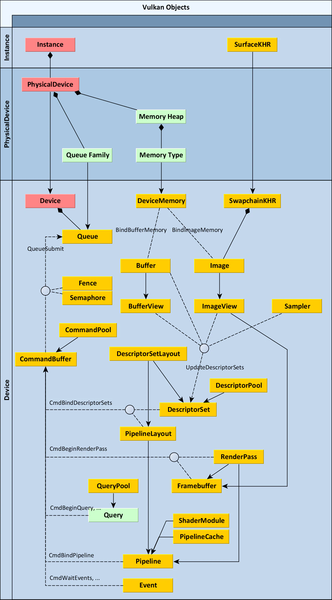
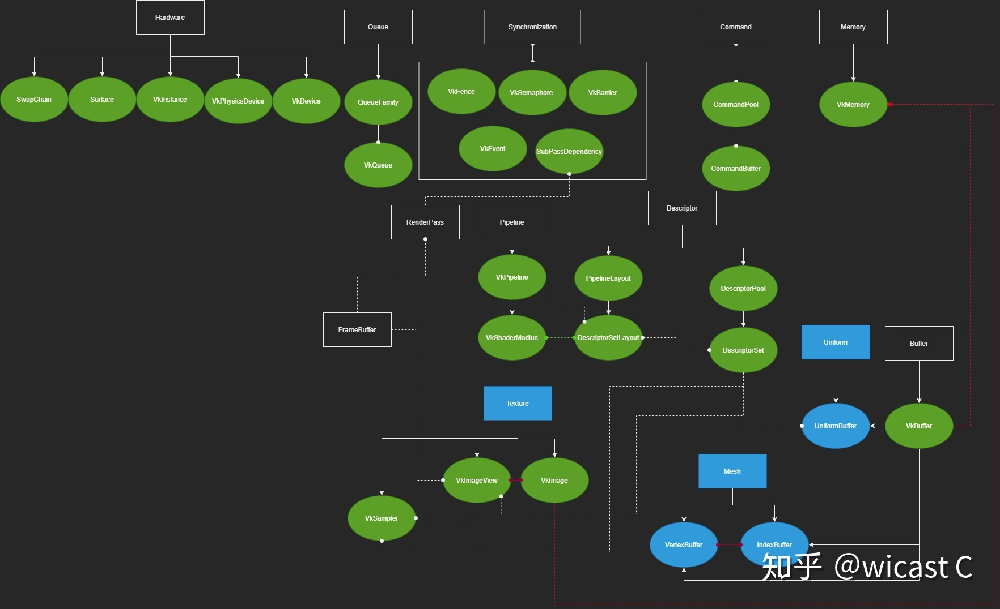
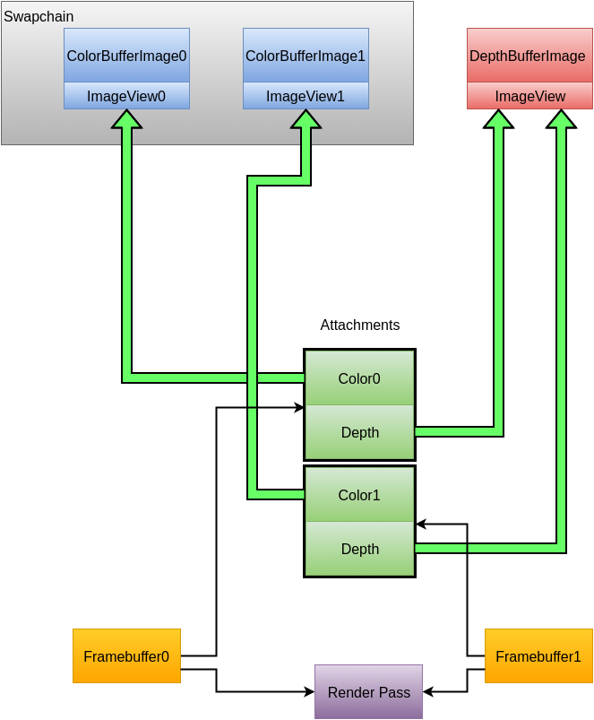

# vulkan 学习路线
### 博客文章
* 学习[官方推荐教程vulkan-tutorial](https://vulkan-tutorial.com/) : 本项目代码就是根据这教程实现的
* [Welcome to VulkanGuide](https://vkguide.dev/)  图文并茂，语言精简
* [中文学习笔记](https://gavinkg.github.io/ILearnVulkanFromScratch-CN/)
* [understanding-vulkan-objects](https://gpuopen.com/learn/understanding-vulkan-objects/)
* 
* 

### 视频资源
* [Vulkan Game Engine Tutorial](https://youtu.be/Y9U9IE0gVHA): 讲解的非常好，非常推荐。

## 坐标系
* OpenGl：
    1. 采用右手坐标系
    2. 标准设备坐标系：[-1, 1]
    3. 深度缓冲值：[0,1]
* vulkan： 
    1. 左手坐标系
    2. 标准化设备坐标是把一种帧缓冲映射到[-1, 1]到[-1, 1]
    3. 深度缓冲值：[minDepth, maxDepth] (由自己定义)

### vulkan核心概念理解
* 多线程部分[Multi-Threading in Vulkan](https://community.arm.com/arm-community-blogs/b/graphics-gaming-and-vr-blog/posts/multi-threading-in-vulkan)
* vulkan同步方案 [Yet another blog explaining Vulkan synchronization](https://themaister.net/blog/2019/08/14/yet-another-blog-explaining-vulkan-synchronization/)
* 提交顺序：commandBuffer——>  VkSubmitInfo   ----->  vkQueueSubmit ------> GPU 
    | 对象 | 命令提交顺序 |
    | :--- | :---- |
    | vkQueueSubmit| 多次vkqueueSubmit，提交顺序为调用顺序|
    | vkSubmitInfo|  vkQueueSubmit一次提交多个vksubmitInfo按照此数组的下标顺序 |
    | vkSubmitInfo|  填入的多个CommandBuffer，按照自己数组下标顺序 |
    | CommandBuffer | 1.不在renderPass中的命令，这些命令的提交顺序为按照在CPU上写入的顺序； 2.subpass 提交顺序按照写入顺序，但是在renderpass不存在任何提交顺序 |
* vkQueueWaitIdle()函数同步：
    1. 用于CPU与GPU之间。
* Fence 同步：
    1. Fence用于CPU和GPU之间的同步， 它有两种状态——signaled和unsignaled
    2.  vkWaitForFences会让CPU在当前位置被阻塞掉，然后一直等待到它接受的Fence变为signaled的状态
    3. 使用vkGetFenceStatus轮询
* semaphore信号量：
    1. GPU内部命令之间的同步
* swapchain :
    1. surface的基本兼容性（交换链支持的最小最大图像数量， 最小最大宽高）
    2. 表面格式 （像素格式，色彩空间）
    3. 显示模式 : 显示模式是交换链最重要的设置项，因为它决定了如何把图像显示到屏幕上: 1. 立即模式 2.队列排对刷新（双缓冲）3.不等待上一个，直接将渲染好的而图像显示大屏幕，会撕裂画面 4.不阻塞，直接用新的代替队列中的图像
    4. 

## 纹理
* 创建可被Shader读取的texture过程：
*   | createBuffer |  createImage | copyBufferToImage| 
    | :---| :--- | :--- |
    | 创建vkBuffer| 创建vkImage | 从vkBuffer拷贝图形数据到vkImage|
* Pipeline Barrier(image memory barrier):
    1. 用于imageLayout转换：
        | Format\detail | layout | access Mask| Stage|
        |:--- | :--- | :--- |:---- |
        |临时vkBuffer | VK_IMAGE_LAYOUT_UNDEFINED | 初始状态也不关心VK_IMAGE_LAYOUT_UNDEFINED | VK_PIPELINE_STAGE_TOP_OF_PIPE_BIT无需等待 |
        |图像vkImage| VK_IMAGE_LAYOUT_TRANSFER_DST_OPTIMAL  | 允许写入VK_ACCESS_TRANSFER_WRITE_BIT | VK_PIPELINE_STAGE_TRANSFER_BIT传输阶段|
        | shader read | VK_IMAGE_LAYOUT_SHADER_READ_ONLY_OPTIMAL| shader读取VK_ACCESS_SHADER_READ_BIT | 片元着色VK_PIPELINE_STAGE_FRAGMENT_SHADER_BIT |
* 为什么要做格式转化呢？
    - [图像布局和排列 Image Layout & Tiling](./ImageLayout_Tiling.md)
## vulkan对象
* vulkan Image vs Framebuffer vs swapchain:
    1. **VkMemory** is just a sequence of N bytes in memory. 
    2. **VkImage** object adds to it e.g. information about the format (so you can address by texels, not bytes).
    3. **VkImageView** 本质就是对vkImage的一个封装，提供一些访问接口。object helps select only part (array or mip) of the VkImage (like stringView, arrayView or whathaveyou does). Also can help to match to some incompatible interface (by type casting format).
    4. **VkFramebuffer** binds a VkImageView with an attachment.
    5. **VkRenderpass** defines which attachment will be drawn into
* [renderTarget](./Image/VulkanRenderTarget.png)

## Descriptor Set 
* **descriptorLayout**: 主要用来约束descriptrSet对象有多少Buffer和image，用于创建DescrioptorSet的信息。
* **descriptorSet**: 必须要通过vkUpdateDescriptorSets()函数，将descriptor和实际的buffer数据关联起来。 descriptor其实就是实际buffer或者image的指针，但是无法独立存在，必须依附于descriptorSet。 