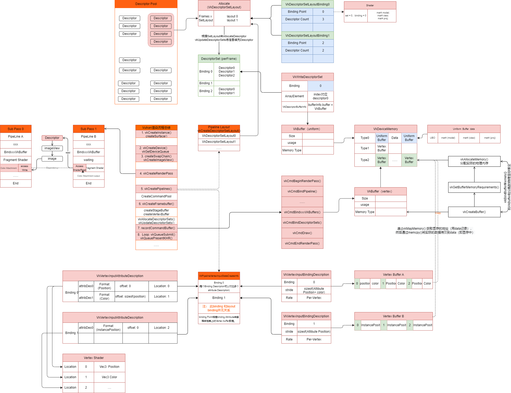

#! https://zhuanlan.zhihu.com/p/598557707
# Vulkan渲染流程总结

## RenderPileline

## Vulkan 的起源

和以前的那些图形 API 一样， Vulkan 也被设计成了跨 GPU 平台抽象的。那些 API 大多存在的问题是，在设计它们的时代，图形硬件大多被限制在可配置的固定功能上。程序员必须以标准格式提供顶点数据，并在光照和阴影选项方面受制于 GPU 制造商。

随着显卡架构的日益成熟，他们开始提供越来越多的可编程功能。但是这些新功能都是以某种方式利用已有的API被集成进去的。这导致了不理想的抽象，以及在显卡将程序员的意图映射到现代图形架构时产生的许多猜测行为。这就是驱动要经常更新来为游戏提供更好的显示性能的原因，有时甚至能大幅提高性能。出于这种复杂性，应用开发者们也得处理各种供应商的显卡之间的不一致，比如[着色器](https://zh.wikipedia.org/wiki/%E7%9D%80%E8%89%B2%E5%99%A8)的语法。除了这些新功能之外，在过去的十年中涌现出许多拥有强劲显卡的移动设备。这些移动设备的 GPU 根据功耗和空间需求的不同有着不同的架构。一个有代表性的例子就是[基于图块渲染](https://zh.wikipedia.org/wiki/%E5%9F%BA%E4%BA%8E%E5%9B%BE%E5%9D%97%E6%B8%B2%E6%9F%93)，通过赋予程序员更大的控制权来获得更好的性能。另一个来自于旧时代 API 的限制在于有限的多线程支持，这往往是造成 CPU 端性能瓶颈的原因。

Vulkan 通过为现代图形架构从头重新设计 API 的方式解决了这个问题。它通过让程序员使用更多的 API 来明确地声明自己意图的方式降低了驱动的开销，并且允许多个线程并行地创建和提交命令。它通过将着色器程序通过编译器编译成标准化的字节码的方式减少了编译着色器时的不一致性。最后，它承认现代显卡的通用处理能力，并且将计算和图形功能统一到了同一个API中。

## 画一个三角形需要分几步

现在来看看在一个行为良好的 Vulkan 程序中渲染一个三角形所需要的所有步骤的概述。此处介绍的所有概念在接下来的章节中会详细说明。此处只是为了让一览整个流程，让把每个单独组件之间联系起来。

### 第一步 创建实例和表面

Vulkan 应用程序从一个 [`VkInstance`](https://www.khronos.org/registry/vulkan/specs/1.0/man/html/VkInstance.html) （实例）来设置 Vulkan API 开始。创建一个实例则需要描述的应用程序和想使用的 API 扩展。创建实例之后，可以查询支持 Vulkan 的硬件设备并且选择一个或多个 [`VkPhysicalDevice`](https://www.khronos.org/registry/vulkan/specs/1.0/man/html/VkPhysicalDevice.html) （物理设备）来使用。可以查询设备的属性（比如显存大小）和能力来选择所需设备，比如独立显卡。

除非只想离屏渲染，会需要一个窗口来显示渲染的图像。窗口可以使用原生平台 API 或者像是 [GLFW](http://www.glfw.org/) 以及 [SDL](https://www.libsdl.org/) 之类的图形库来创建。

还需要另外两个组件来把图像渲染到窗口上：一个表面（`VkSurfaceKHR`, surface）和一个交换链（`VkSwapchainKHR`, swap chain）。注意一下，这个`KHR`后缀说明这些对象是 Vulkan 扩展（extension）的一部分。Vulkan API 本身是完全平台无关的，因此必须使用标准化的 WSI （Window System Interface，窗口系统接口）扩展来与窗口管理器进行交互。表面（surface）是一个跨平台的、对要渲染的窗口的抽象，它通常需要传入一个原生窗口的句柄来实例化，比如Windows上的`HWND`。幸运的是，GLFW库内置了一个函数来帮处理不同平台上的细节。

### 第二步 逻辑设备和队列家族

在选择了合适的硬件设备之后，需要创建一个 [`VkDevice`](https://www.khronos.org/registry/vulkan/specs/1.0/man/html/VkDevice.html) （逻辑设备），可以在其中更具体地描述想使用哪些 [`VkPhysicalDeviceFeatures`](https://www.khronos.org/registry/vulkan/specs/1.0/man/html/VkPhysicalDeviceFeatures.html) （物理设备特性），比如多视口渲染以及 64 位浮点数。同时，也需要指明想使用的队列家族（queue families）。绝大多数 Vulkan 操作，比如绘图命令和内存操作，都是通过提交到[`VkQueue`](https://www.khronos.org/registry/vulkan/specs/1.0/man/html/VkQueue.html)（队列）来异步执行的。队列从队列家族中分配，每个队列家族支持一组特定的操作。例如，可能存在不同的队列家族进行图形、计算和内存传输操作。队列家族的可用性也可以成为在选择物理显卡时的一个影响因素。可能存在一些支持 Vulkan 却不提供任何图形功能的设备，不过目前所有支持Vulkan操作的显卡都可以完成感兴趣的所有队列操作。

### 第三步 创建交换链

交换链是渲染目标的集合。它最基本的作用就是确保现在正在**渲染的图像与现在显示在屏幕上的图像不是同一个**。这对确保只有渲染完成的图像才会被显示十分重要。每当想要绘制一个帧的时候，必须向交换链请求一个图像来进行渲染。当完成绘制之后，再把这个图像返回到交换链中以便在某个时间点显示。渲染对象的数量以及将渲染好的图像显示到屏幕上的条件由显示模式（present mode）决定。常见的渲染模式有双缓冲（垂直同步）和三缓冲。在交换链那一章再详细讨论这些问题。

在一些平台上可以使用 `VK_KHR_display` 和 `VK_KHR_display_swapchain` 扩展直接渲染到显示器上，而无需与任何窗口管理器交互。举个例子，可以通过这些扩展创建一个代表整个屏幕的表面，来实现自己的窗口管理器。

### 第四步 渲染路径

Vulkan 中的渲染路径（render passes）描述了在渲染操作时要使用的图像附件类型、图像的使用方式以及处理图像的内容的方式。在最初的这个绘制三角形的应用中，将告诉 Vulkan ，将会使用一个图像作为颜色目标，并且想要在绘制之前把它清除为纯色（*例如：opengl的 `glClearColor`* ）。然而一个渲染路径只描述图像的类型，[`VkFramebuffer`](https://www.khronos.org/registry/vulkan/specs/1.0/man/html/VkFramebuffer.html)（帧缓冲）才会把这些选项匹配到具体的图像上。

### 第五步 图形管线

Vulkan 中的图形管线由[`VkPipeline`](https://www.khronos.org/registry/vulkan/specs/1.0/man/html/VkPipeline.html)（管线）来建立。它描述了显卡的一些可配置部分（不可编程部分），比如视口大小以及深度缓冲操作等，而可编程部分则使用[`VkShaderModule`](https://www.khronos.org/registry/vulkan/specs/1.0/man/html/VkShaderModule.html)（着色器模块）对象来描述。[`VkShaderModule`](https://www.khronos.org/registry/vulkan/specs/1.0/man/html/VkShaderModule.html)（着色器模块）对象使用着色器的字节码来创建。驱动还需要知道管线中的哪些渲染目标会被使用，这些渲染目标由通过引用渲染路径来指定。

Vulkan 与现有的其它API之间最明显的区别就是，图形管线的几乎所有配置项都需要在创建管线之前设置好。这意味着如果想切换到另一个着色器或者稍微改变一下顶点数据的布局，都需要重新创建整个图形管线。这意味着，需要针对在渲染操作时的具体情况提前创建许多[`VkPipeline`](https://www.khronos.org/registry/vulkan/specs/1.0/man/html/VkPipeline.html)（管线）对象，以满足渲染操作所需的所有不同组合。只有很少的一些基本配置可以动态更改，比如视口大小和清屏颜色等。还必须明确地描述管线中的所有配置项，比如说没有默认的颜色混合选项。

好消息是，就像提前编译（AOT）与即时编译（JIT）的区别那样，驱动有更多的优化机会，并且运行时性能将会更加具有可预测性，因为大量的状态更改是非常明确的，比如切换不同的图形管线。

### 第六步 图像视图和帧缓冲

为了在从交换链中请求到的图像上进行绘制，需要用[`VkImageView`](https://www.khronos.org/registry/vulkan/specs/1.0/man/html/VkImageView.html)（图像视图）和[`VkFramebuffer`](https://www.khronos.org/registry/vulkan/specs/1.0/man/html/VkFramebuffer.html)（帧缓冲）把它包装起来。图像视图引用了一个图像中要被使用的特定部分，而帧缓冲则引用一些图像视图并把它们当作颜色、深度和模板目标使用。因为在一个交换链中可能有多个不同的图像，所以提前为每一个图像创建一个图像视图和一个帧缓冲，并且在绘制时选择合适的那个。

### 第七步 命令池和命令缓冲

正如之前所说，在 Vulkan 中，许多想要执行的操作，比如绘制操作，都需要被提交到一个队列中去。这些操作在提交之前需要先被记录到一个[`VkCommandBuffer`](https://www.khronos.org/registry/vulkan/specs/1.0/man/html/VkCommandBuffer.html)（命令缓冲）中。命令缓冲由[`VkCommandPool`](https://www.khronos.org/registry/vulkan/specs/1.0/man/html/VkCommandPool.html)（命令池）分配，每个命令池与一个特定的队列家族相关联。为了画出一个三角形，需要在命令缓冲里记录下列操作：
* 开始渲染过程
* 绑定图形渲染管线
* 画三个顶点
* 结束渲染过程

因为帧缓冲中的图像取决于交换链具体会给哪一个，需要为每一个可能使用的图像记录一个命令缓冲，然后在绘制的时候选择合适的那个。另外一种可行的方法是每一帧都重新记录一次命令缓冲，但是这种方法效率不高。

### 第八步 主循环

现在绘制命令已经被包装到了命令缓冲里，那主循环就十分简单明了了。首先通过`vkAcquireNextImageKHR`来从交换链中获得一个图像，之后为这个图像选择合适的命令缓冲并且用[`vkQueueSubmit`](https://www.khronos.org/registry/vulkan/specs/1.0/man/html/vkQueueSubmit.html)来执行。最后，用`vkQueuePresentKHR`把这个图像返回到交换链中以供显示。

提交到队列中的操作是异步执行的。因此必须使用一个信号量等这样的同步对象来保证执行顺序正确。绘图命令缓存必须被设置为等到获取图像之后再执行，否则可能导致开始渲染一个正在读取以在屏幕上显示的图像。`vkQueuePresentKHR`函数反过来又需要等待渲染完成，为此需要第二个信号量，并且在渲染完成后发出信号。

### 小结

以上这些简单的讲解应该让对绘制一个三角形所需要做的工作有了一个基本的认识。然而真正要做的程序包含了更多的步骤，比如分配顶点缓存，创建 uniform 缓存以及上传纹理图像等。

所以长话短说，画出第一个三角形需要：
1. 创建一个[`VkInstance`](https://www.khronos.org/registry/vulkan/specs/1.0/man/html/VkInstance.html)（实例）和 创建一个表面。
2. 选择一个受支持的显卡（[`VkPhysicalDevice`](https://www.khronos.org/registry/vulkan/specs/1.0/man/html/VkPhysicalDevice.html)（物理设备））,  为绘制和显示创建一个[`VkDevice`](https://www.khronos.org/registry/vulkan/specs/1.0/man/html/VkDevice.html)（逻辑设备）和[`VkQueue`](https://www.khronos.org/registry/vulkan/specs/1.0/man/html/VkQueue.html)（队列）。
3. 创建交换链，再把交换链里的图像包裹到[`VkImageView`](https://www.khronos.org/registry/vulkan/specs/1.0/man/html/VkImageView.html)（图像视图）里面
    a. 表面格式（像素格式，色彩空间）
    b. 显示模式（在屏幕上“交换”图像的条件：立即模式，双缓冲，单缓冲）
    c. 交换范围（交换链中图像的分辨率）
4. 创建一个渲染过程（RenderPass）来指定渲染目标和渲染目标的使用方法
    a. 规定附件（颜色附件，深度附件）
    b. 规定缓冲中样本数Sample。
    c. 规定样本内容如何处理（loadOp， storeOp）
5. 设置GraphicsPipeline图形渲染管线
    a. 可编程部分 VkShaderModule
    b. 固定设置功能部分： 顶点输入， 顶点装配（assemble），视口（由swapchain控制），光栅化阶段设置，多重采样，深度测试和模板测试，颜色混合，**管线布局**（包含描述符）。
6. 为渲染过程创建帧缓冲
    a. 将图像视图（VkImageView）附件绑定到帧缓冲中。
    b. 设置帧缓冲的长宽（width，height需要根据swapchain来设置）。
7. 为交换链中每个可用的图像分配并用绘制命令记录命令缓冲（命令池管理命令缓冲，且需要分配到特定的队列家族中。）
    a. 启动RenderPass（这个时候Renderpass需要绑定帧缓冲）。
    b. 绑定到图形渲染管线中（graphicsPipeline）
    c. 绑定顶点数据，索引数据和描述符集。
    d. 设置绘制命令（vkcmdDrawXXX）。 结束renderPass，结束CommmadBuffer
8. 通过获取图像绘制帧，提交正确的那个渲染命令缓存并把图像返回到交换链中
    a. 从交换链中请求一个图像vkAcquireNextImageKHR。 作为帧缓冲的附件。
    b.  提交绘制命令graphicsQueue到图形队列。
    c. 将图像提交到交换链显示vkQueuePresentKHR。
### 参考资料
1. [Vulkan Tutorial] 
2. [Vulkan specification]

