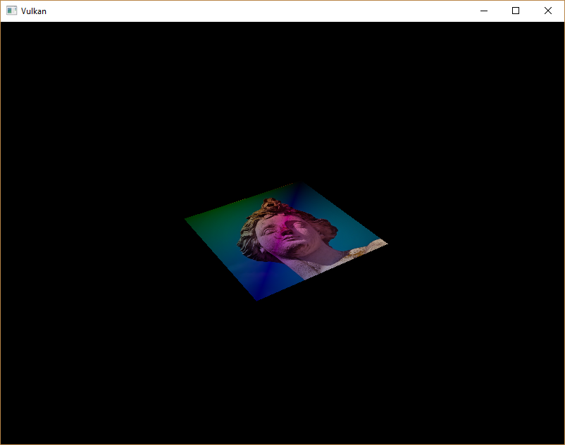

# 组合图像采样器
## 介绍
在之前的章节，我们已经对描述符有所了解，这一章节，我们将介绍一种新的描述符类型：组合图像采样器。着色器可以通过这一类型的描述符访问图像资源。

我们首先会修改描述符布局，描述符池和描述符集来使用组合图形采样器描述符。然后，我们会添加纹理坐标信息到Vertex结构体。最后，我们修改片段着色器从纹理中读取颜色数据。

## 更新描述符
在createDescriptorSetLayout函数中填写用于组合图像采样器描述符的VkDescriptorSetLayoutBinding结构体信息。将下面的代码放在uniform缓冲绑定之后：
```c++
VkDescriptorSetLayoutBinding samplerLayoutBinding = {};
samplerLayoutBinding.binding = 1;
samplerLayoutBinding.descriptorCount = 1;
samplerLayoutBinding.descriptorType = VK_DESCRIPTOR_TYPE_COMBINED_IMAGE_SAMPLER;
samplerLayoutBinding.pImmutableSamplers = nullptr;
samplerLayoutBinding.stageFlags = VK_SHADER_STAGE_FRAGMENT_BIT;

std::array<VkDescriptorSetLayoutBinding, 2> bindings = {uboLayoutBinding, samplerLayoutBinding};
VkDescriptorSetLayoutCreateInfo layoutInfo = {};
layoutInfo.sType = VK_STRUCTURE_TYPE_DESCRIPTOR_SET_LAYOUT_CREATE_INFO;
layoutInfo.bindingCount = static_cast<uint32_t>(bindings.size());
layoutInfo.pBindings = bindings.data();
```
设置stageFlags成员变量指明在片段着色器中使用组合图像采样器描述符。在顶点着色器也可以进行纹理采样，一个常见的用途是在顶点着色器中使用高度图[heightmap](https://en.wikipedia.org/wiki/Heightmap).纹理来对顶点进行变形。

现在在开启校验层的情况下编译运行程序，我们会得到描述符池不能分配该类型的描述符集这一信息。这一因为我们原来创建的描述符池对象并没有包含组合图像采样器描述符，为了解决这一问题，我们修改createDescriptorPool函数，添加一个用于组合图像采样器描述符的VkDescriptorPoolSize结构体信息：
```c++
std::array<VkDescriptorPoolSize, 2> poolSizes = {};
poolSizes[0].type = VK_DESCRIPTOR_TYPE_UNIFORM_BUFFER;
poolSizes[0].descriptorCount = static_cast<uint32_t>(swapChainImages.size());
poolSizes[1].type = VK_DESCRIPTOR_TYPE_COMBINED_IMAGE_SAMPLER;
poolSizes[1].descriptorCount = static_cast<uint32_t>(swapChainImages.size());

VkDescriptorPoolCreateInfo poolInfo = {};
poolInfo.sType = VK_STRUCTURE_TYPE_DESCRIPTOR_POOL_CREATE_INFO;
poolInfo.poolSizeCount = static_cast<uint32_t>(poolSizes.size());
poolInfo.pPoolSizes = poolSizes.data();
poolInfo.maxSets = static_cast<uint32_t>(swapChainImages.size());
```

描述符池不足是验证问题的一个很好的例子层不会捕获：从 Vulkan 1.1 开始，`vkAllocateDescriptorSets` 可能会失败. 如果池不是，则错误代码为“VK_ERROR_POOL_OUT_OF_MEMORY”足够大，但驱动程序也可能会尝试在内部解决问题。这意味着有时（取决于硬件、池大小和分配大小）司机会让我们逃脱超过限制的分配我们的描述符池。 其他时候，`vkAllocateDescriptorSets` 会失败并且返回 `VK_ERROR_POOL_OUT_OF_MEMORY`。 这可能会特别令人沮丧，如果分配在某些机器上成功，但在其他机器上失败。
由于 Vulkan 将分配的责任转移给了驱动程序，因此不会不再严格要求只分配某个特定的描述符类型（`VK_DESCRIPTOR_TYPE_COMBINED_IMAGE_SAMPLER`等）由对应的 `descriptorCount` 成员用于创建描述符池。但是，这样做仍然是最佳做法，并且在未来，如果启用，`VK_LAYER_KHRONOS_validation` 将警告此类问题 [Best Practice Validation](https://vulkan.lunarg.com/doc/view/1.1.126.0/windows/best_practices.html).

最后，我们在createDescriptorSets函数中绑定图像和采样器到描述符集中的描述符：
```c++
for (size_t i = 0; i < MAX_FRAMES_IN_FLIGHT; i++) {
    VkDescriptorBufferInfo bufferInfo{};
    bufferInfo.buffer = uniformBuffers[i];
    bufferInfo.offset = 0;
    bufferInfo.range = sizeof(UniformBufferObject);

    VkDescriptorImageInfo imageInfo{};
    imageInfo.imageLayout = VK_IMAGE_LAYOUT_SHADER_READ_ONLY_OPTIMAL;
    imageInfo.imageView = textureImageView;
    imageInfo.sampler = textureSampler;

    ...
}
```
需要使用VkDescriptorImageInfo结构体为组合图像采样器指定图像资源。
```c++
std::array<VkWriteDescriptorSet, 2> descriptorWrites = {};

descriptorWrites[0].sType = VK_STRUCTURE_TYPE_WRITE_DESCRIPTOR_SET;
descriptorWrites[0].dstSet = descriptorSets[i];
descriptorWrites[0].dstBinding = 0;
descriptorWrites[0].dstArrayElement = 0;
descriptorWrites[0].descriptorType =
VK_DESCRIPTOR_TYPE_UNIFORM_BUFFER;
descriptorWrites[0].descriptorCount = 1;
descriptorWrites[0].pBufferInfo = &bufferInfo;

descriptorWrites[1].sType = VK_STRUCTURE_TYPE_WRITE_DESCRIPTOR_SET;
descriptorWrites[1].dstSet = descriptorSets[i];
descriptorWrites[1].dstBinding = 1;
descriptorWrites[1].dstArrayElement = 0;
descriptorWrites[1].descriptorType = VK_DESCRIPTOR_TYPE_COMBINED_IMAGE_SAMPLER;
descriptorWrites[1].descriptorCount = 1;
descriptorWrites[1].pImageInfo = &imageInfo;

vkUpdateDescriptorSets(device, static_cast<uint32_t>(descriptorWrites.size()),
					descriptorWrites.data(), 0, nullptr);
```
描述符必须使用此图像信息更新，就像缓冲区一样。 这个时间我们使用`pImageInfo`数组而不是`pBufferInfo`。 描述符现在可以被着色器使用了！

## 纹理坐标
我们需要使用纹理坐标来将纹理映射到几何图元上。
```c++
struct Vertex {
	glm::vec2 pos;
	glm::vec3 color;
	glm::vec2 texCoord;

	static VkVertexInputBindingDescription getBindingDescription() {
		VkVertexInputBindingDescription bindingDescription = {};
		bindingDescription.binding = 0;
		bindingDescription.stride = sizeof(Vertex);
		bindingDescription.inputRate = VK_VERTEX_INPUT_RATE_VERTEX;

		return bindingDescription;
	}

	static std::array<VkVertexInputAttributeDescription, 3> getAttributeDescriptions() {
		std::array<VkVertexInputAttributeDescription, 3>
		attributeDescriptions = {};

		attributeDescriptions[0].binding = 0;
		attributeDescriptions[0].location = 0;
		attributeDescriptions[0].format = VK_FORMAT_R32G32_SFLOAT;
		attributeDescriptions[0].offset = offsetof(Vertex, pos);

		attributeDescriptions[1].binding = 0;
		attributeDescriptions[1].location = 1;
		attributeDescriptions[1].format = VK_FORMAT_R32G32B32_SFLOAT;
		attributeDescriptions[1].offset = offsetof(Vertex, color);

		attributeDescriptions[2].binding = 0;
		attributeDescriptions[2].location = 2;
		attributeDescriptions[2].format = VK_FORMAT_R32G32_SFLOAT;
		attributeDescriptions[2].offset = offsetof(Vertex, texCoord);

		return attributeDescriptions;
	}
};
```
修改Vertex结构体添加一个新的vec2类型变量来存储纹理坐标。添加一个新的VkVertexInputAttributeDescription对象用于在顶点着色器访问顶点的纹理坐标。这样我们才能将纹理坐标传递给片段着色器使用。
```c++
const std::vector<Vertex> vertices = {
					{{-0.5f, -0.5f}, {1.0f, 0.0f, 0.0f}, {1.0f, 0.0f}},
					{{0.5f, -0.5f}, {0.0f, 1.0f, 0.0f}, {0.0f, 0.0f}},
					{{0.5f, 0.5f}, {0.0f, 0.0f, 1.0f}, {0.0f, 1.0f}},
					{{-0.5f, 0.5f}, {1.0f, 1.0f, 1.0f}, {1.0f, 1.0f}}
};
``` 
在本教程，我们为渲染的矩形的四个顶点指定纹理图像的四个顶点作为纹理坐标。

## 着色器
现在可以修改着色器从纹理中采样颜色数据。我们首先需要修改顶点着色器将纹理坐标传递给片段着色器：
```c++
layout(location = 0) in vec2 inPosition;
layout(location = 1) in vec3 inColor;
layout(location = 2) in vec2 inTexCoord;

layout(location = 0) out vec3 fragColor;
layout(location = 1) out vec2 fragTexCoord;

void main() {
	gl_Position = ubo.proj * ubo.view * ubo.model * vec4(inPosition, 0.0, 1.0);
	fragColor = inColor;
	fragTexCoord = inTexCoord;
}
```
fragTexCoord的值会被插值后传递给片段着色器。我们可以通过将纹理坐标输出为片段颜色来形象地认知这一插值过程：
```c++
#version 450
#extension GL_ARB_separate_shader_objects : enable

layout(location = 0) in vec3 fragColor;
layout(location = 1) in vec2 fragTexCoord;

layout(location = 0) out vec4 outColor;

void main() {
	outColor = vec4(fragTexCoord, 0.0, 1.0);
}
```
重新编译我们的着色器代码，然后编译运行应用程序，将会看到下面的画面：


我们这里使用绿色通道来表示x坐标，使用红色通道来表示y坐标。通过上图的黑色和黄色角落，我们可以确定矩形左上角顶点的纹理坐标为(0，0)，右下角顶点的纹理坐标为(1，1)。这种通过将变量值作为片段颜色输出的方法是一个很有用的调试着色器的手段。

在GLSL中，使用uniform变量来表示组合图像采样器描述符。为了在片段着色器中使用描述符，我们需要添加下面的代码：
```c++
layout(binding = 1) uniform sampler2D texSampler;
// 对于一维图像和二维图像需要使用对应的sampler1D和sampler3D变量类型来绑定描述符。

void main() {
	outColor = texture(texSampler, fragTexCoord);
}
```
在GLSL纹理采样需要使用GLSL内建的texture函数。texture函数使用一个采样器变量和一个纹理坐标作为参数对纹理进行采样。采样器会自动按照我们设定的过滤和变换方式对纹理进行采样。现在编译运行程序，可以看到下面的画面：


```c++
void main() {
	outColor = texture(texSampler, fragTexCoord * 2.0);
}
```
读者可以尝试通过将纹理坐标设置为大于1.0的值来观察寻址模式对纹理采样的影响。下图是使用VK_SAMPLER_ADDRESS_MODE_REPEAT寻址模式产生的效果：


我们还可以同时使用顶点颜色和纹理颜色来产生最终的片段颜色：
```c++
void main() {
	outColor = vec4(fragColor * texture(texSampler, fragTexCoord).rgb, 1.0);
}
```
下图是这样做后产生的效果：


现在，我们已经明白了如何在着色器中访问图像数据。通过这项技术，我们可以实现许多复杂的效果，比如后期处理，延迟着色等等。