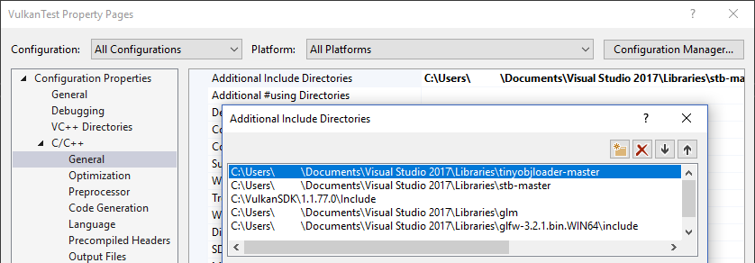
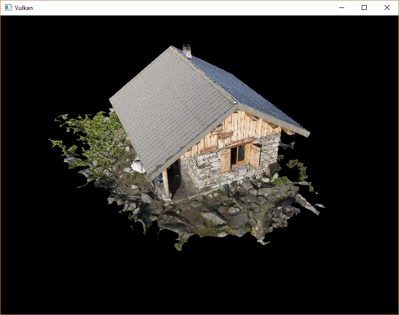

# 载入模型
## 介绍
本章节我们将会渲染一个带有纹理的三维模型。

## 库
我们使用tinyobjloader库来从OBJ文件加载顶点数据。tinyobjloader库是一个简单易用的单文件OBJ加载器，我们只需要下载tiny_obj_loader.h文件，然后在代码中包含这一头文件就可以使用它了。

## Visual Studio
将tiny_obj_loader.h加入Additional Include Directories paths中：

**Makefile**
将tiny_obj_loader.h所在目录加入编译器的包含目录中：
```c++
VULKAN_SDK_PATH = /home/user/VulkanSDK/x.x.x.x/x86_64
STB_INCLUDE_PATH = /home/user/libraries/stb
TINYOBJ_INCLUDE_PATH = /home/user/libraries/tinyobjloader

		...

CFLAGS = -std=c++11 -I$(VULKAN_SDK_PATH)/include -I$(STB_INCLUDE_PATH) -I$(TINYOBJ_INCLUDE_PATH)
```
## 网格样例
在本章节，我们暂时不使用光照，只简单地将纹理贴在模型上。读者可以从[Sketchfab](https://sketchfab.com/).找到自己喜欢的OBJ模型来加载。
在这里，我们加载的模型叫做Chalet Hippolyte Chassande Baroz。我们对它的大小和方向进行了调整：

For this tutorial I've decided to go with the [Viking room](https://sketchfab.com/3d-models/viking-room-a49f1b8e4f5c4ecf9e1fe7d81915ad38)
model by [nigelgoh](https://sketchfab.com/nigelgoh) ([CC BY 4.0](https://web.archive.org/web/20200428202538/https://sketchfab.com/3d-models/viking-room-a49f1b8e4f5c4ecf9e1fe7d81915ad38)). I tweaked the size and orientation of the model to use it
as a drop in replacement for the current geometry:
* [viking_room.obj](/resources/viking_room.obj)
* [viking_room.png](/resources/viking_room.png)

这一模型大概由50万面三角形构成。读者也可以使用自己的OBJ模型，但需要确保使用的模型给只包含了一个材质，并且模型的大小为1.5x1.5x1.5。如果使用的模型大于这一尺寸，读者就需要对使用的视图矩阵view matrix进行修改。我们新建一个和shaders和textures文件夹同级的models文件夹，用于存放模型文件。

添加两个常量定义我们使用的模型文件路径和纹理文件路径：
```c++
const int WIDTH = 800;
const int HEIGHT = 600;

const std::string MODEL_PATH = "models/chalet.obj";
const std::string TEXTURE_PATH = "textures/chalet.jpg";
```
修改createTextureImage函数使用我们定义的纹理路径常量加载纹理图像：
```c++
stbi_uc* pixels = stbi_load(TEXTURE_PATH.c_str(), &texWidth,
			&texHeight, &texChannels, STBI_rgb_alpha);
```
## 载入顶点和索引
现在我们从模型文件加载顶点数据和索引数据，删除之前我们定义的vertices和indices这两个全局变量，使用大小可变的向量来重新定义它们：
```c++
std::vector<Vertex> vertices;
std::vector<uint32_t> indices;
VkBuffer vertexBuffer;
VkDeviceMemory vertexBufferMemory;
```
由于我们使用的模型包含的顶点个数远远大于65535，所以不能使用uint16_t作为索引的数据类型，而应该使用uint32_t作为索引的数据类型。更改索引数据类型后，还要修改我们调用vkCmdBindIndexBuffer函数时使用的参数：
```c++
vkCmdBindIndexBuffer(commandBuffers[i], indexBuffer, 0, VK_INDEX_TYPE_UINT32);
```
tinyobjloader库的使用和STB库类似，我们需要定义TINYOBJLOADER_IMPLEMENTATION宏来让它包含函数实现，不然就会在编译时出现链接错误：
```c++
#define TINYOBJLOADER_IMPLEMENTATION
#include <tiny_obj_loader.h>
// 现在编写用于载入模型文件的loadModel函数，它负责填充模型数据到vertices和indices。我们在顶点缓冲和索引缓冲创建之前调用它来载入模型数据：

void initVulkan() {
		...
	loadModel();
	createVertexBuffer();
	createIndexBuffer();
		...
}

		...

void loadModel() {

}
```
模型数据的载入是通过调用tinyobj::LoadObj完成的：
```c++
void loadModel() {
	tinyobj::attrib_t attrib;
	std::vector<tinyobj::shape_t> shapes;
	std::vector<tinyobj::material_t> materials;
	std::string err;

	if (!tinyobj::LoadObj(&attrib, &shapes, &materials, &err, MODEL_PATH.c_str())) {
		throw std::runtime_error(err);
	}
}
```
一个OBJ模型文件包含了模型的位置、法线、纹理坐标和表面数据。表面数据包含了构成表面的多个顶点数据的索引。

我们在loadModel函数中使用attrib变量来存储载入的位置、法线和纹理坐标数据。使用shapes变量存储独立的对象和它们的表面数据。每个表面数据包含了一个顶点数组，顶点数组中的每个顶点数据包含了顶点的位置索引、法线索引和纹理坐标索引。OBJ模型文件格式允许为模型的每个表面定义材质和纹理数据，但在这里，我们没有用到。

我们使用err变量来存储载入模型文件时产生的错误和警告信息，比如载入时没有找到引用的材质信息。如果载入模型文件失败，那么tinyobj::LoadObj函数就会返回false。之前提到，OBJ模型文件中的表面数据可以包含任意数量的顶点数据，但我们的程序只能渲染三角形表面，这就需要进行转换将OBJ模型文件中的表面数据都转换为三角形表面。tinyobj::LoadObj函数有一个可选的默认参数，可以设置在加载OBJ模型数据时将表面数据转换为三角形表面。由于这一设置是默认的，所以，我们不需要自己设置它。

接着，我们将加载的表面数据复制到我们的vertices和indices向量中，这只需要遍历shapes向量即可：
```c++
for (const auto& shape : shapes) {

}
```
载入的表面数据已经被三角形化，所以我们可以直接将它们复制到vertices向量中：
```c++
for (const auto& shape : shapes) {
	for (const auto& index : shape.mesh.indices) {
		Vertex vertex = {};

		vertices.push_back(vertex);
		indices.push_back(indices.size());
	}
}
```
为了简化indices数组的处理，我们这里假定每个顶点都是独一无二的，可以直接使用indices数组的当前大小作为顶点索引数据。上面代码中的index变量的类型为tinyobj::index_t，这一类型的变量包含了vertex_index、normal_index和texcoord_index三个成员变量。我们使用这三个成员变量来检索存储在attrib数组变量中的顶点数据：
```c++
vertex.pos = {
			attrib.vertices[3 * index.vertex_index + 0],
			attrib.vertices[3 * index.vertex_index + 1],
			attrib.vertices[3 * index.vertex_index + 2]
};

vertex.texCoord = {
			attrib.texcoords[2 * index.texcoord_index + 0],
			attrib.texcoords[2 * index.texcoord_index + 1]
};

vertex.color = {1.0f, 1.0f, 1.0f};
```
attrib.vertices是一个浮点数组，并非glm::vec3数组，我们需要在使用索引检索顶点数据时首先要把索引值乘以3才能得到正确的顶点数据位置。对于纹理坐标数据，则乘以2进行检索。对于顶点位置数据，偏移值0对应X坐标，偏移值1对应Y坐标，偏移值2对应Z坐标。对于纹理坐标数据，偏移值0对应U坐标，偏移值1对应V坐标。

现在使用优化模式编译我们的程序(使用Visual Studio的Release模式或GCC的-O3编译选项)。这样做可以提高我们的模型加载速度。运行程序，应该可以看到下面这样的画面：


看起来，模型的几何形状是正确的，但纹理映射不对。这是因为Vulkan的纹理坐标的原点是左上角，而OBJ模型文件格式假设纹理坐标原点是左下角。我们可以通过反转纹理的Y坐标解决这一问题：
```c++
vertex.texCoord = {
			attrib.texcoords[2 * index.texcoord_index + 0],
			3 1.0f - attrib.texcoords[2 * index.texcoord_index + 1]
};
```
现在再次编译运行程序，就可以看到被正确映射纹理的模型了：


## 顶点去重
按照之前的处理，我们没有达到索引缓冲节约空间的目的。三角形表面的顶点是被多个三角形表面共用的，而我们则是每个顶点都重新定义一次，vertices向量包含了大量重复的顶点数据。我们可以将完全相同的顶点数据只保留一个，来解决空间。这一去重过程可以通过STL的map或unordered_map来实现：
```c++
#include <unordered_map>

		...

std::unordered_map<Vertex, uint32_t> uniqueVertices = {};

for (const auto& shape : shapes) {
	for (const auto& index : shape.mesh.indices) {
		Vertex vertex = {};

		...

		if (uniqueVertices.count(vertex) == 0) {
			uniqueVertices[vertex] = static_cast<uint32_t>(vertices.size());
			vertices.push_back(vertex);
		}

		indices.push_back(uniqueVertices[vertex]);
	}
}
```
在从OBJ模型文件加载模型数据时，我们检查加载的顶点数据是否与已经加载的数据完全相同，如果相同，就不再将其加入vertices向量，将已经加载的顶点数据的索引存储到indices向量中。如果不同，将其加入vertices向量，并存储它对应的索引值到uniqueVertices容器中。然后将其索引存储在indices向量中。

我们需要实现两个函数来让Vertex结构体可以作为map变量的键值来检索map变量，首先是==函数：
```c++
bool operator==(const Vertex& other) const {
	return pos == other.pos && color == other.color && texCoord == other.texCoord;
}
```
然后是对Vertex结构体进行哈希的函数：
```c++
namespace std {
	template<> struct hash<Vertex> {
	size_t operator()(Vertex const& vertex) const {
			return ((hash<glm::vec3>()(vertex.pos)
				^ (hash<glm::vec3>()(vertex.color) << 1)) >> 1)
				^ (hash<glm::vec2>()(vertex.texCoord) << 1);
		}
	};
}
```
上面这两个函数的代码需要放在Vertex结构体的定义外。GLM库的变量类型的哈希函数可以通过下面的代码包含到我们的程序中：
```c++
#define GLM_ENABLE_EXPERIMENTAL
#include <glm/gtx/hash.hpp>
```
GLM库的哈希函数目前还是一个试验性的扩展，被定义在了GLM库的gtx目录下。所以需要我们定义GLM_ENABLE_EXPERIMENTAL宏来启用它。作为试验性扩展意味着在未来版本的GLM库有可能发生变化，但一般而言，我们可以认为变化不会太大。

现在重新编译运行程序，查看vertices向量的大小，可以发现vertices向量的大小从1，500，000下降到了265，645。这也说明对于我们的模型数据，每个顶点数据平均被6个三角形表面使用。